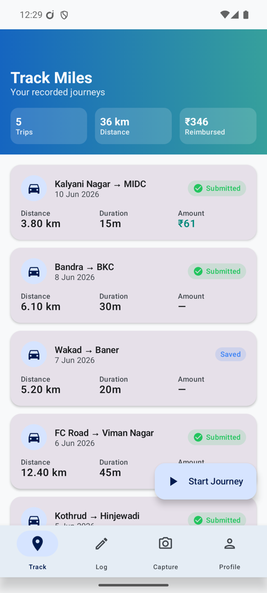
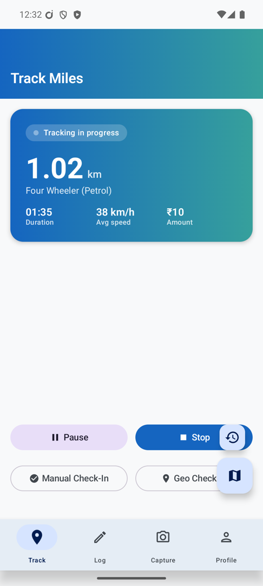
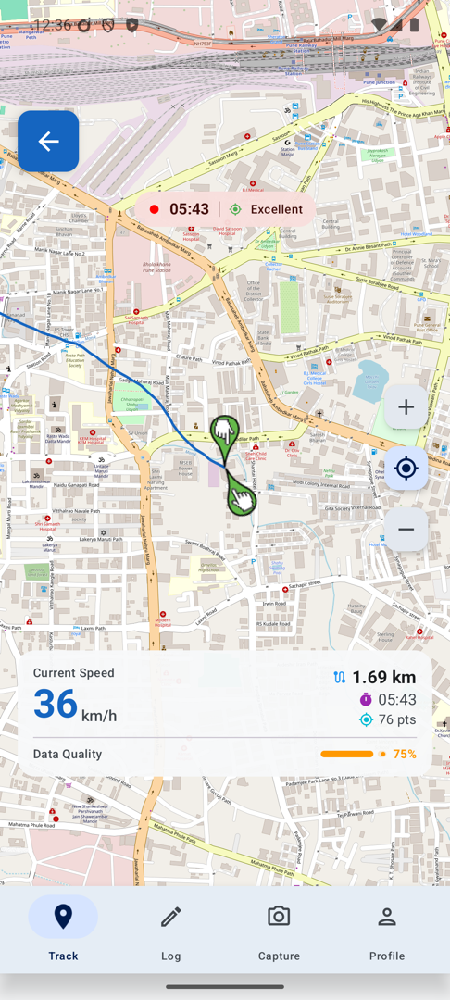
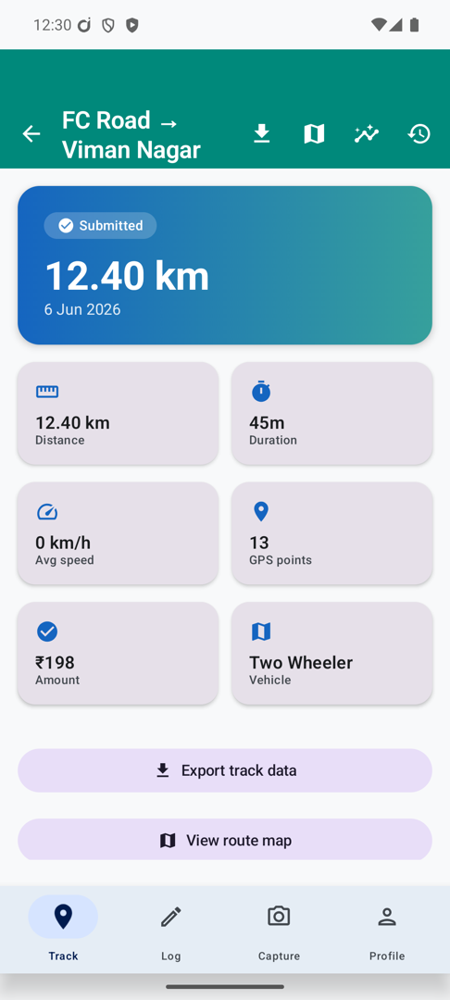
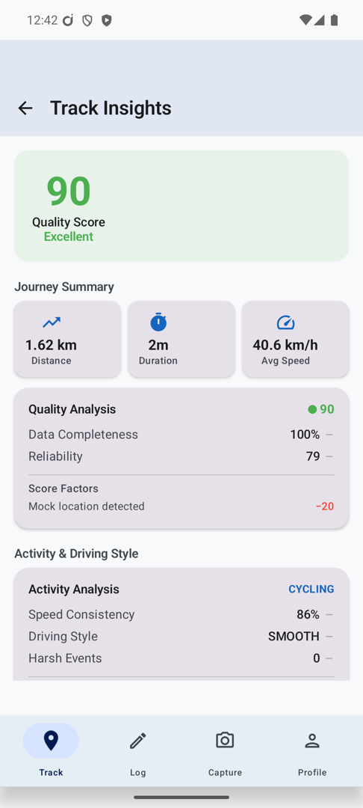
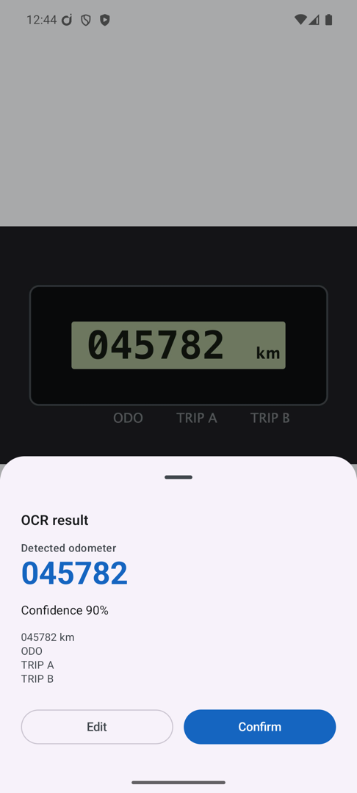
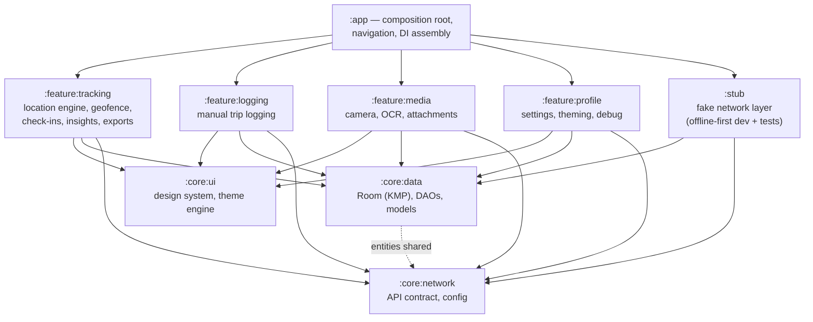
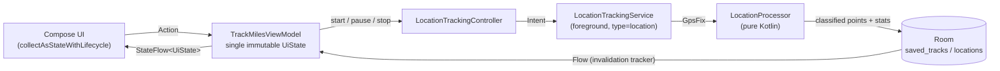

# MileTracker

A production-grade mileage & trip tracking app built with **Compose Multiplatform** — demonstrating the location-engineering, offline-first, and multi-module architecture patterns I use in production apps serving 50k+ MAU.

**Stack:** Compose Multiplatform 1.10 · Kotlin 2.3 · Room 2.8 (KMP) · Koin · kotlinx coroutines/serialization/datetime · ML Kit · osmdroid

## Screenshots

| Trip history | Live tracking | Route map |
|:---:|:---:|:---:|
|  |  |  |

| Track detail | Trip insights | Odometer OCR |
|:---:|:---:|:---:|
|  |  |  |

## What it does

- **High-accuracy trip tracking** — foreground service feeding a pure-Kotlin processing pipeline: jitter suppression, spike detection, mock-location flagging, and a per-bucket distance breakdown persisted with every track
- **Odometer OCR** — on-device ML Kit text recognition + document scanner, with a pure-Kotlin parser that survives OCR misreads
- **Geofenced check-ins** — local geofence detection with manual check-in fallback
- **Route rendering** — OpenStreetMap (osmdroid) polylines with abnormal/filtered points color-classified
- **Trip insights** — analyzers for trip quality, activity classification, system impact, and distance integrity
- **Exports** — CSV / GPX / KML / GeoJSON / JSON via `FileProvider` share sheet
- **Receipts & attachments** — camera capture persisted alongside trip submissions
- **Theming & settings** — palette customization, locale switching, experimental feature toggles

## Architecture

Multi-module, MVI, offline-first. Feature modules never depend on each other — they meet only at the `:app` composition root, and all of them talk to the same `core` layer.



### MVI data flow (tracking screen)



The service and the ViewModel never hold references to each other: the service writes live stats to Room, and the ViewModel observes the same rows as a `Flow`. This survives process death for free — on restart the ViewModel finds the active track in the database and reattaches to the live stream.

## The location engine

This is a public rebuild of GPS-accuracy work I led on a production fleet-tracking platform (raw GPS distance accuracy improved from ~50% to ~95% of ground truth). The core ideas, all visible in [`TrackingPipeline.kt`](feature/tracking/src/main/kotlin/com/miletracker/feature/tracking/service/location/TrackingPipeline.kt):

**1. Trust nothing the GPS says by default.** Every fix passes through `LocationProcessor`, a pure-Kotlin, Android-free pipeline (fully unit-tested on the JVM). Each point is classified before it can contribute distance:

- **Jitter suppression** — while parked, GPS wanders a few metres per fix; naively summing Haversine displacements inflates a stationary hour into hundreds of phantom metres. Displacements under a threshold are suppressed, but the *anchor point is kept*, so a later genuine move is measured from the last persisted position rather than accumulating drift.
- **Spike detection** — teleporting fixes (tunnel exits, cold starts, multipath bounces) are caught by implied speed: if `displacement / Δt` exceeds a plausibility ceiling, the point is recorded but flagged abnormal and excluded from the cleaned distance.
- **Mock-location flagging** — points from mock providers are bucketed separately rather than silently dropped, so reimbursement fraud is *detectable*, not just prevented.

**2. Account for every metre.** Distance is accumulated into four buckets — `original / cleaned / abnormal / mock` — and all four are persisted per track. The UI shows the trustworthy cleaned figure, but the raw figure is never thrown away: when a driver disputes a reimbursement, the delta between buckets explains exactly what was filtered and why.

**3. Sensor fusion for context, not correction.** A `TrackingSensorMonitor` attaches the latest accelerometer + gyroscope snapshot to every persisted point. The IMU data isn't used to "fix" GPS in-line — it feeds the post-hoc insight analyzers (activity classification, hard-braking/spike correlation, walking-vs-driving discrimination), which is where it actually earns its battery cost.

**4. Survive the platform.** Tracking runs in a `location`-type foreground service with a partial wake lock, persists its session in `DataStore` so a process kill mid-trip is recoverable, records hardware events (power saver, battery optimization, app kill, shutdown) as first-class data on the track, and restores via a boot receiver. On OEM builds that kill services aggressively, *knowing the track was interrupted* is half the accuracy battle.

The repo ships with `SIMULATE_LOCATION = true` — a simulated drive source feeds believable fixes (gentle heading drift, realistic speeds, occasional mock-flagged points) through the exact same pipeline, so the full tracking flow works on an emulator with no GPS.

## Testing

200+ JVM unit tests, no emulator required (`./gradlew :app:testDebugUnitTest`). The strategy is deliberate:

- **Pure-Kotlin core** — the distance pipeline, OCR parser, insight analyzers, check-in validator, and export writers have no Android imports, so the highest-risk logic is tested directly on the JVM.
- **ViewModel tests with fakes at the boundary** — [`TrackMilesViewModelTest`](app/src/test/java/com/miletracker/TrackMilesViewModelTest.kt) runs the real repository over an in-memory `StateFlow`-backed DAO fake (mirroring Room's invalidation-tracker behaviour), reuses the same stub network layer the app ships with, and mocks only the fire-and-forget service façade — covering process-death restore, the live service→DB→UI stream, and lifecycle edge cases like straggler writes after stop.
- **`StandardTestDispatcher` everywhere** — asynchrony is explicit (`advanceUntilIdle`), so tests can assert intermediate states deterministically instead of racing real dispatchers.

## Running

```bash
./gradlew :app:installDebug
```

Requires JDK 17+ and an Android device/emulator (API 30+). The `stub` module fakes the backend and a seeder provides demo journeys, so the app runs fully offline.
