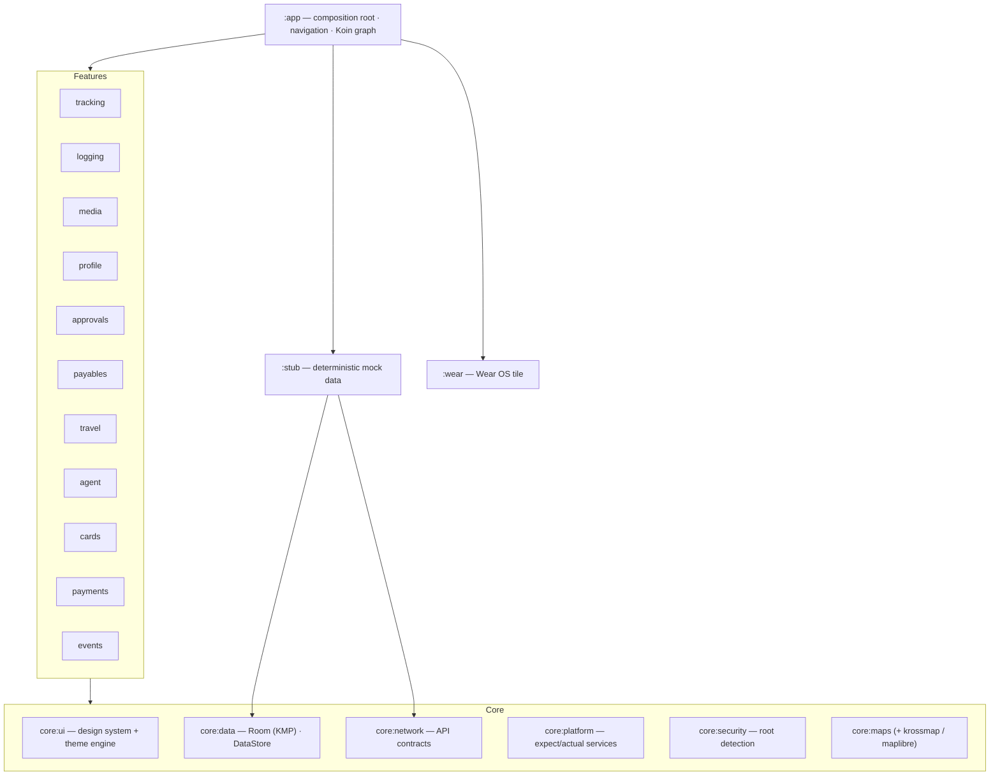

<div align="center">


# Mileway

### Offline-first mileage, travel &amp; expense tracking — in Kotlin &amp; Compose Multiplatform.

A standalone, **fully-offline** app showcasing location-engineering, offline-first, and
multi-module architecture patterns in Kotlin / Compose Multiplatform.
Every screen runs on deterministic mock data, with **zero backend calls**.

[](https://github.com/darkpandawarrior/Mileway/actions/workflows/ci.yml)
[](https://github.com/darkpandawarrior/Mileway/actions/workflows/quality.yml)


**[Highlights](#highlights)** · **[Screenshots](#screenshots)** · **[Features](#features)** · **[Architecture](#architecture)** · **[Getting started](#getting-started)** · **[Roadmap](#roadmap)**

</div>

---

<details>
<summary><b>Table of contents</b></summary>

- [Why Mileway](#why-mileway)
- [Highlights](#highlights)
- [Screenshots](#screenshots)
- [Features](#features)
- [Architecture](#architecture)
  - [Module map](#module-map)
  - [Project structure](#project-structure)
- [Tech stack](#tech-stack)
- [Getting started](#getting-started)
- [Build flavors](#build-flavors)
- [Testing and quality](#testing-and-quality)
- [Roadmap](#roadmap)
- [iOS and Wear OS](#ios-and-wear-os)
- [The location engine](#the-location-engine)

</details>

## Why Mileway

Mileway is a clean, **self-contained, offline-first** mileage tracker. It works end-to-end in
airplane mode — trips are tracked, expenses logged, approvals routed — and data survives a restart,
all without a single network dependency in tracked code.

It doubles as a working reference for modern Android / KMP patterns: **Kotlin / Compose
Multiplatform**, a **multi-module clean architecture** (23 Gradle modules), **MVI-style
unidirectional state**, **Koin** DI, **Room (KMP)** + **DataStore**, and a dual **`gms` / `noGms`**
flavor split so the same app ships to both the Play Store and F-Droid.

## Highlights

- 🛰️ **Real location engineering** — a tracking pipeline engineered to suppress GPS jitter and
  recover from spikes: spike detection, four-bucket distance accounting, and IMU fusion.
- 📴 **Genuinely offline** — no backend URLs, no API keys, no network calls in tracked code. Runs in
  airplane mode; state persists via Room + DataStore.
- 🧩 **23-module clean architecture** — feature modules never touch each other; they meet only at the
  `:app` composition root, wired through Koin.
- 🌍 **Kotlin Multiplatform** — shared `commonMain` core compiles for Android **and** iOS; platform
  services sit behind `expect`/`actual`.
- 🔀 **One codebase, two distributions** — a `gms` Play build and a FOSS `noGms` / F-Droid build, with
  a dependency-prefix guard that fails the build if proprietary libraries leak into FOSS.
- 🧪 **Quality gates that run in CI** — JVM unit tests, Roborazzi screenshot tests (no emulator),
  detekt, ktlint and Kover, plus reproducible F-Droid release workflows.

## Screenshots

> All screens render from deterministic mock data. Images are recorded with
> [Roborazzi](https://github.com/takahirom/roborazzi) on the JVM — **no emulator required**
> (`./gradlew recordRoborazziNoGmsDebug`).

|  Live GPS Tracking  |  Tracking Success  |  Odometer OCR  |
|:---:|:---:|:---:|
|  |  |  |

<details>
<summary><b>More screenshots</b> — tracking, logging, approvals, payments, events, travel &amp; security (50 total)</summary>

<br/>

**Tracking**

| Saved Trips | Track Insights | Geo Check-In | Route Map |
|---|---|---|---|
|  |  |  |  |

**Logging &amp; Approvals**

| Log Miles | Approvals Queue | Hardware Events |
|---|---|---|
|  |  |  |

**Payments, Events &amp; Travel**

| Create Payment | Payments History | Create Event |
|---|---|---|
|  |  |  |

| Events History | Booking History | Trip History |
|---|---|---|
|  |  |  |

**Security &amp; Diagnostics**

| Root Guard — signals detected | Root Guard — clean device |
|---|---|
|  |  |

<sub>Full set in <a href="docs/screenshots"><code>docs/screenshots/</code></a> (50 images, including payables, cards, analytics and component matrices).</sub>

</details>

## Features

Every feature is fully interactive on mocked, offline data.

| Area | What's inside |
|---|---|
| **Tracking** | Live GPS trip tracking on a foreground service (jitter suppression, spike detection, four-bucket accounting); geofenced check-in with manual fallback; saved tracks (journey/submission tabs); trip insights; hardware-events log; GPX / CSV / KML / GeoJSON export. |
| **Logging &amp; Expenses** | Step-by-step manual trip logging; expense entry → detail → success chain. |
| **Travel** | Travel hub, active-trip card (flight / train), upcoming bookings, plus trip &amp; booking history surfaces. |
| **Approvals &amp; Payables** | Approval queue with policy-violation badges and seek-clarification sheet; payables hub, multi-step create-PR / invoice flows and history surfaces. |
| **Payments, Events &amp; Cards** | QR pay / request + history; event creation + history; card home / detail / request (KYC-lite). |
| **Profile &amp; Account** | Account hub, advance requests, Canvas-rendered analytics dashboards, an AI assistant sheet, notification centre, permission-health screen, and a MaterialKolor theme engine. |
| **Media** | CameraX capture (flash, pinch-zoom, tap-focus), on-device odometer OCR, attachment grid. |
| **Master search** | A registry-based search that fans a query across every feature module. |

## Architecture

Multi-module clean architecture. **Feature modules never depend on one another** — they meet only at
the `:app` composition root. State is **unidirectional**: each screen exposes a single immutable
state as a `StateFlow`, collected with `collectAsStateWithLifecycle`, with a shared `ScreenState`
wrapper modelling loading / empty / error / content.



**Key patterns**

- **commonMain-first KMP** — core modules compile for Android + iOS (`iosArm64`, `iosSimulatorArm64`).
  Platform-bound tech (FusedLocation, CameraX, ML Kit, WorkManager, BiometricPrompt, foreground
  service) sits behind `expect`/`actual` interfaces in `:core:platform`.
- **Koin DI** — one module per feature; the `InitKoin()` bootstrap is re-entrancy-safe for both the
  Android `Application` and the iOS entry point.
- **SearchProvider registry** — each feature binds a `SearchProvider` into Koin; the master-search
  aggregator resolves `getAll<SearchProvider>()` and fans out — zero coupling between search and features.
- **Shared scaffolds** — `FormSubmissionScaffold` and `HistoryListScaffold` standardise the create
  and history flows reused across travel / payables / payments / events.
- **Navigation** — type-safe JetBrains Compose Navigation with per-feature graphs assembled at `:app`.

### Module map

| Module | Responsibility |
|---|---|
| `:app` | Composition root, navigation host, Koin graph assembly, build flavors |
| `:core:ui` | Compose design system, theme engine (MaterialKolor), Canvas charts, shared scaffolds |
| `:core:data` | Room (KMP) database, DAOs, entities, DataStore repositories |
| `:core:network` | API contract &amp; policy models (mocked) |
| `:core:platform` | `expect`/`actual` platform-service interfaces + Android/iOS impls |
| `:core:security` | Device-integrity (root) detection, encryption-ready storage |
| `:core:maps` · `-krossmap` · `-maplibre` | Map-surface contract + flavor-specific implementations |
| `:core:common` | Shared utilities / primitives |
| `:feature:*` | tracking · logging · media · profile · approvals · payables · travel · agent · cards · payments · events |
| `:stub` | Deterministic mock data for every repository (no backend) |
| `:wear` | Wear OS companion tile |
| `build-logic` | Gradle convention plugins (centralised AGP / Kotlin / Compose config) |

### Project structure

```text
Mileway/
├── app/                      # Android application — composition root, navigation, DI, flavors
├── core/
│   ├── ui/                   # Compose design system, theme engine, shared scaffolds
│   ├── data/                 # Room (KMP) + DataStore
│   ├── network/              # API contracts (mocked)
│   ├── platform/             # expect/actual platform services
│   ├── security/             # root detection, encryption-ready storage
│   ├── maps/ maps-krossmap/ maps-maplibre/   # map-surface contract + impls
│   └── common/               # shared utilities
├── feature/                  # tracking · logging · media · profile · approvals
│                             # payables · travel · agent · cards · payments · events
├── stub/                     # deterministic mock data for every repository
├── wear/                     # Wear OS companion tile
├── build-logic/              # Gradle convention plugins
├── docs/                     # README assets, screenshots, release & brand docs
└── fastlane/                 # store metadata + screenshots
```

## Tech stack

| Layer | Technology |
|---|---|
| Language | Kotlin **2.4.0** |
| UI | Compose Multiplatform **1.11.1**, Material 3 |
| Build | AGP **9.2.1**, Gradle Kotlin DSL, convention plugins, version catalog |
| DI | Koin **4.2.2** (multiplatform) |
| Database | Room **2.8.4** (KMP, bundled SQLite) |
| Settings / session | AndroidX DataStore |
| Networking | Ktor **3.5.0** (OkHttp + Darwin engines) — mocked, no live backend |
| Concurrency | Coroutines + Flow (no LiveData); `kotlinx-datetime` **0.8.0** in commonMain |
| Maps | osmdroid / MapLibre (`noGms`, offline MBTiles) · KrossMap (`gms`) |
| Charts | Canvas-only (no MPAndroidChart / Vico) |
| Testing | JUnit, MockK, Turbine, Robolectric, Koin-Test, **Roborazzi 1.64.0** screenshots |
| Quality | detekt **1.23.8**, ktlint, Kover, dependency-guard |
| SDK | compileSdk **37**, minSdk **30**, JDK 21 |

## Getting started

```bash
git clone https://github.com/darkpandawarrior/Mileway.git
cd Mileway

# Assemble the offline-safe default build
./gradlew assembleNoGmsDebug

# Install on a device/emulator (API 30+)
adb install app/build/outputs/apk/noGms/debug/app-noGms-debug.apk
```

No network connection is required — all data is mock and persists locally via Room + DataStore.

> **Offline check:** enable airplane mode, track a trip, kill and relaunch the app, and confirm the
> record persisted.

<details>
<summary><b>All build &amp; tooling commands</b></summary>

```bash
# Build variants
./gradlew assembleNoGmsDebug          # FOSS / offline build (default)
./gradlew assembleGmsDebug            # Google-services build
./gradlew assembleNoGmsRelease        # reproducible FOSS release (F-Droid)

# Tests & screenshots (noGms — gms crashes Robolectric)
./gradlew testNoGmsDebugUnitTest      # JVM unit tests (88 test classes, no emulator)
./gradlew recordRoborazziNoGmsDebug   # (re)record screenshot baselines → docs/screenshots/

# Quality
./gradlew ktlintCheck detekt          # style + static analysis
./gradlew :app:koverXmlReport         # coverage report
```

</details>

## Build flavors

A `maps` flavor dimension splits the app into a proprietary and a FOSS build:

| Flavor | Maps | Google / Play / Firebase | Use case |
|---|---|---|---|
| `gms` | KrossMap (Google Maps / MapKit) | Firebase + Play services | Play Store build |
| `noGms` | MapLibre + offline MBTiles (no API key) | none — FOSS-clean | F-Droid / fully offline |

A dependency-prefix guard fails the build if proprietary libraries leak into the `noGms` classpath.

## Testing and quality

- **JVM unit tests** — 88 test classes (ViewModels, repositories, feature logic) with MockK + Turbine,
  run on the `noGms` flavor (no emulator).
- **Screenshot tests** — Roborazzi renders 50 screens/components on the JVM and writes them to
  `docs/screenshots/`; deterministic and diffable in PRs.
- **Static analysis** — detekt + ktlint across every module; Kover for coverage.
- **CI** — `.github/workflows/ci.yml` runs `assembleGmsDebug` + `testNoGmsDebugUnitTest` on every push
  and PR; separate `quality`, `release` and `publish-fdroid` workflows handle gates and distribution.

## Roadmap

A snapshot of where Mileway is and where it's heading. This is a portfolio/demo project, so the
roadmap reflects direction rather than commitments.

**Shipped**

- [x] Offline-first app on deterministic mock data (zero backend calls)
- [x] 23-module clean architecture with Koin DI
- [x] Compose Multiplatform UI; `commonMain` core compiles for Android + iOS
- [x] `gms` / `noGms` flavor split + FOSS dependency-prefix guard
- [x] Room (KMP) + DataStore persistence
- [x] Location engine (jitter / spike / four-bucket / IMU fusion) with a simulated drive source
- [x] Master search — registry across feature modules + aggregator, results screen and navigation
- [x] Roborazzi screenshot suite, detekt / ktlint / Kover, CI + release workflows
- [x] Wear OS companion tile

**In progress**

- [ ] iOS **UI** parity — core modules compile to a framework today; feature screens are moving
      from `androidMain` into `commonMain`
- [ ] Expand the screenshot catalog to cover every screen (payments / events / history added)

**Exploring**

- [ ] Baseline Profiles for startup/scroll performance
- [ ] watchOS companion &amp; iOS WidgetKit surfaces
- [ ] Instrumented (on-device) UI test tier alongside the JVM suite
- [ ] Accessibility pass (TalkBack, semantics, large-font / RTL)
- [ ] Larger bundled offline map packs

## iOS and Wear OS

- **iOS** — every `:core:*` module compiles to an iOS framework, with `expect`/`actual` services
  backed by CoreLocation, Vision (OCR), UserNotifications, LocalAuthentication and BackgroundTasks.
  A few proprietary integrations (in-app update, install-referrer) are stubbed with `TODO(ios)`
  markers; the shared Compose UI renders through a minimal SwiftUI host.
- **Wear OS** — `:wear` ships a `MileageTileService` tile surfacing today's distance.

## The location engine

The tracking pipeline is engineered to suppress jitter and recover from GPS spikes:

- **Jitter suppression** — stationary drift is filtered while the anchor point is preserved.
- **Spike detection** — an implied-speed check flags teleporting fixes without discarding them.
- **Four-bucket accounting** — `original / cleaned / abnormal / mock` are all persisted per track.
- **Mock-location flagging** — fraud is detectable, not merely blocked.
- **IMU fusion** — accelerometer + gyroscope snapshots feed post-hoc insight analyzers.

`SIMULATE_LOCATION = true` ships a simulated drive source that feeds believable fixes through the
exact same pipeline, so the full tracking flow works on an emulator with no GPS hardware.

---

<div align="center">
<sub>Mileway is a portfolio / demo project. All companies, bookings, cards and amounts are fictional mock data.</sub>
</div>
