<div align="center">


# Mileway

**An offline-first mileage, travel & expense tracker — built with Kotlin Multiplatform and Compose Multiplatform.**

A standalone, fully-offline demo that showcases the location-engineering, offline-first, and
multi-module architecture patterns behind a production app serving 50k+ MAU — every screen runs
on deterministic mock data, with zero backend calls.

[](https://github.com/darkpandawarrior/Mileway/actions/workflows/ci.yml)
[](https://github.com/darkpandawarrior/Mileway/actions/workflows/quality.yml)


</div>

---

## Why this exists

Mileway extracts a real, entangled mileage-tracking feature out of a large production codebase and
stands it up as a clean, **self-contained, offline-first** app. It works end-to-end in airplane
mode: trips are tracked, expenses logged, approvals routed, and data persists across restarts — all
without a single network dependency in tracked code.

It doubles as a reference for the patterns I use at scale: **Kotlin/Compose Multiplatform**, a
**multi-module clean architecture** (21 Gradle modules), **MVI-style unidirectional state**,
**Koin DI**, **Room (KMP)** + **DataStore**, and a dual **`gms` / `noGms`** flavor split so the same
app ships to both the Play Store and F-Droid.

## Screenshots

> All screens render from deterministic mock data. Images are recorded with [Roborazzi](https://github.com/takahirom/roborazzi) on the JVM — **no emulator required** (`./gradlew recordRoborazziNoGmsDebug`).

### Tracking

| Live GPS Tracking | Tracking Success | Saved Trips |
|---|---|---|
| 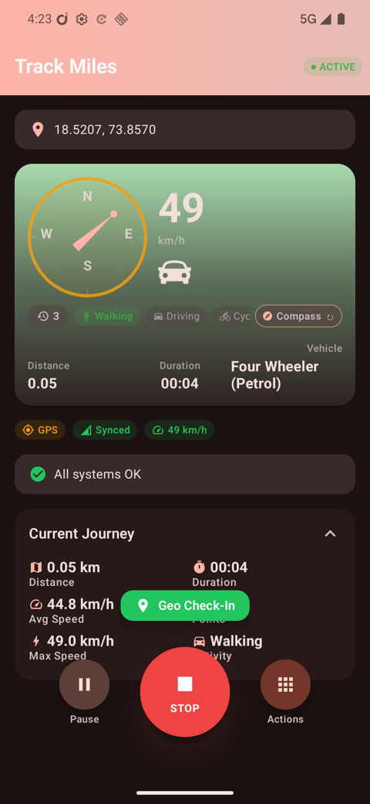 | 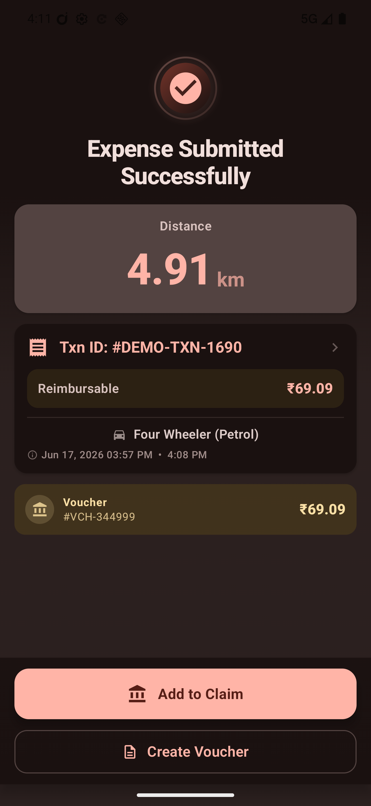 |  |

| Track Insights | Geo Check-In | Route Map |
|---|---|---|
| 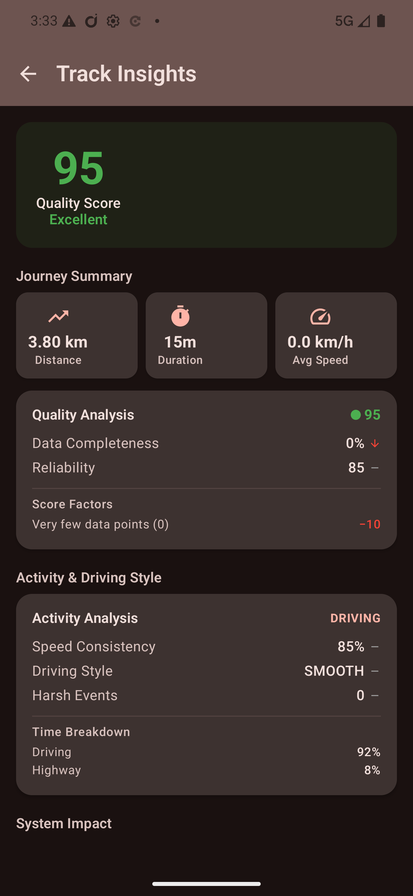 | 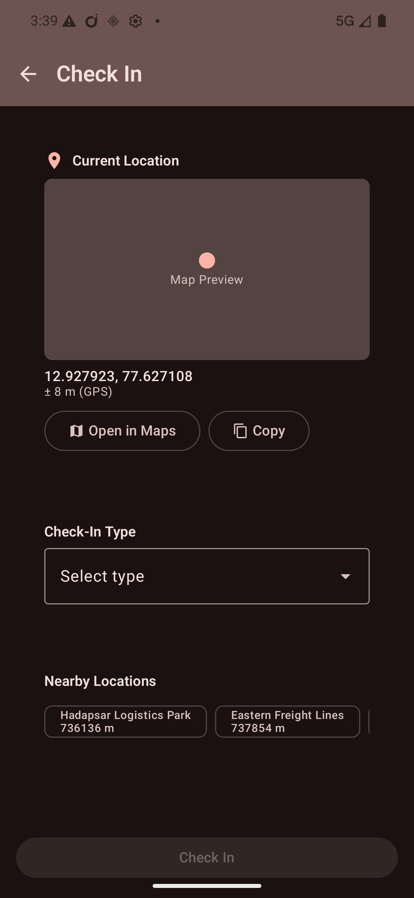 | 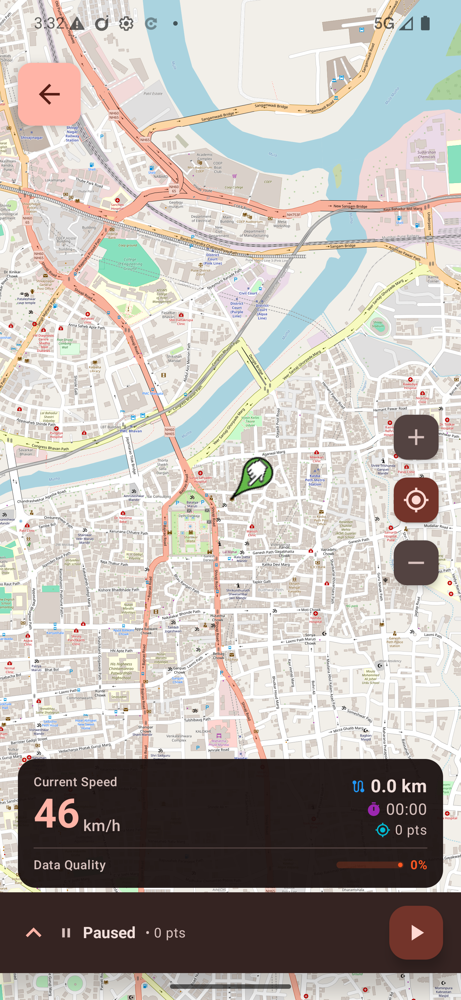 |

### Logging, Approvals & Platform

| Log Miles | Approvals Queue | Odometer OCR |
|---|---|---|
| 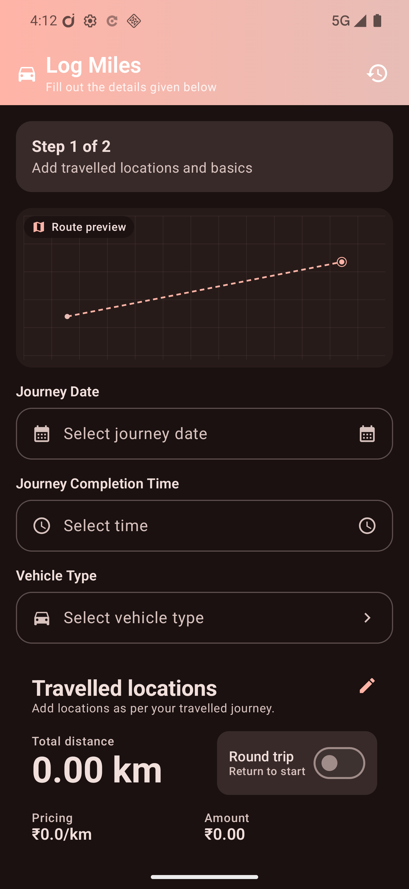 | 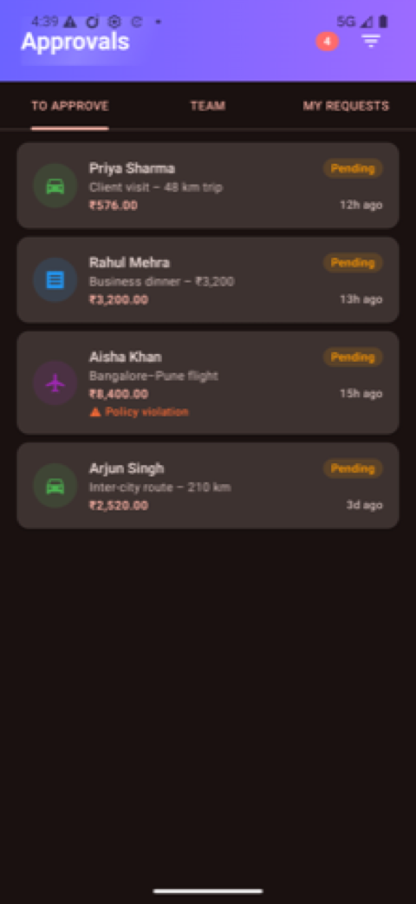 | 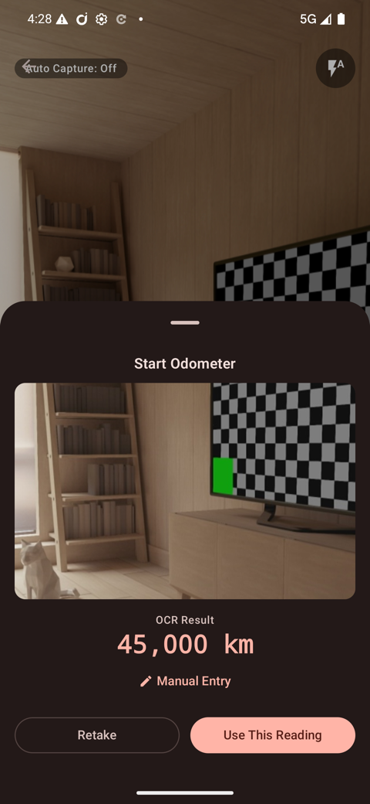 |

### Payments, Events & Travel

| Create Payment | Payments History | Create Event |
|---|---|---|
|  |  |  |

| Events History | Booking History | Trip History |
|---|---|---|
|  |  |  |

### Security & Diagnostics

| Root Guard — signals detected | Root Guard — clean device | Hardware Events |
|---|---|---|
| 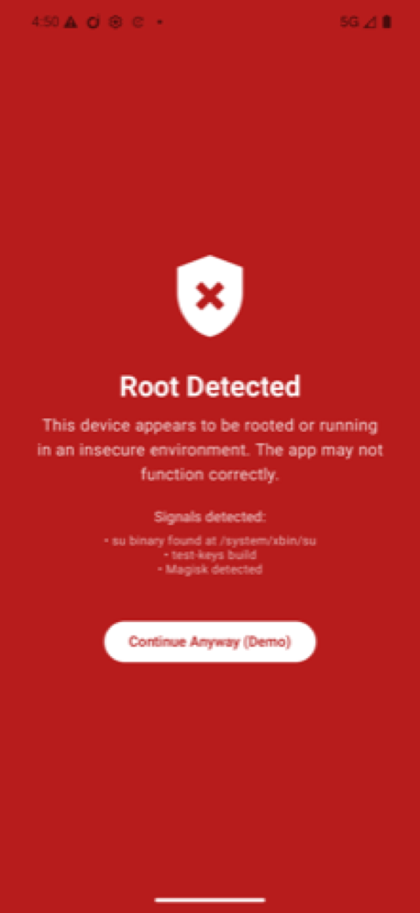 | 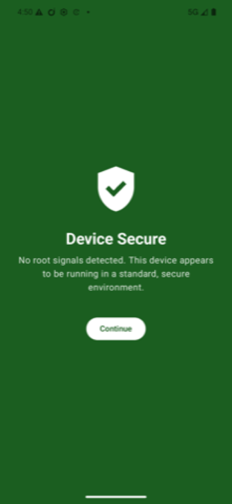 | 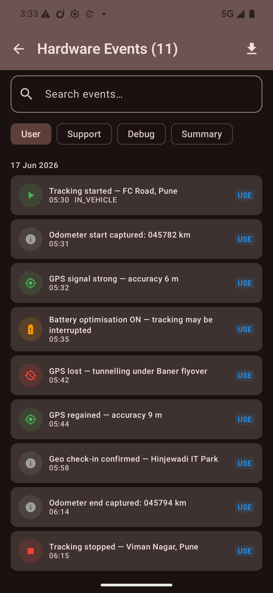 |

<sub>More captures in [`docs/screenshots/`](docs/screenshots) (50 total, covering travel bookings, payables, payments, events, cards, analytics and component matrices).</sub>

## Features

Every feature is fully interactive on mocked, offline data.

- **Tracking** — live GPS trip tracking on a foreground service with jitter suppression, spike
  detection, and four-bucket distance accounting (`original / cleaned / abnormal / mock`); geofenced
  check-in with manual fallback; saved tracks (journey/submission tabs); trip insights; hardware
  events log; GPX/CSV/KML/GeoJSON export.
- **Logging & Expenses** — step-by-step manual trip logging, expense entry → detail → success chain.
- **Travel** — travel hub, active-trip card (flight/train), upcoming bookings, plus trip & booking
  history surfaces.
- **Approvals & Payables** — approval queue with policy-violation badges and seek-clarification
  sheet; payables hub, multi-step create-PR / invoice flows, and history surfaces.
- **Payments, Events, Cards** — QR pay/request + history, event creation + history, card home /
  detail / request (KYC-lite).
- **Profile & Account** — account hub, advance requests, Canvas-rendered analytics dashboards, an AI
  assistant sheet, notification centre, permission-health screen, and a MaterialKolor theme engine.
- **Media** — CameraX capture (flash, pinch-zoom, tap-focus), on-device odometer OCR, attachment grid.
- **Master search** — a registry-based search that fans a query across every feature module.

## Tech stack

| Layer | Technology |
|---|---|
| Language | Kotlin **2.4.0** |
| UI | Compose Multiplatform **1.11.1**, Material 3 |
| Build | AGP **9.2.1**, Gradle Kotlin DSL, convention plugins, version catalog |
| DI | Koin **4.2.2** (multiplatform) |
| Database | Room **2.8.4** (KMP, bundled SQLite) |
| Settings / session | AndroidX DataStore |
| Networking | Ktor **3.5.0** (OkHttp + Darwin engines) — mocked, no live backend |
| Concurrency | Coroutines + Flow (no LiveData); `kotlinx-datetime` **0.8.0** in commonMain |
| Maps | osmdroid / MapLibre (`noGms`, offline MBTiles) · KrossMap (`gms`) |
| Charts | Canvas-only (no MPAndroidChart / Vico) |
| Testing | JUnit, MockK, Turbine, Robolectric, Koin-Test, **Roborazzi 1.64.0** screenshots |
| Quality | detekt **1.23.8**, ktlint, Kover, dependency-guard |
| SDK | compileSdk **37**, minSdk **30**, JDK 21 |

## Architecture

Multi-module clean architecture. Feature modules never depend on one another — they meet only at the
`:app` composition root. State is unidirectional: each screen exposes a single immutable state as a
`StateFlow`, collected with `collectAsStateWithLifecycle`, with a shared `ScreenState` wrapper
modelling loading / empty / error / content.

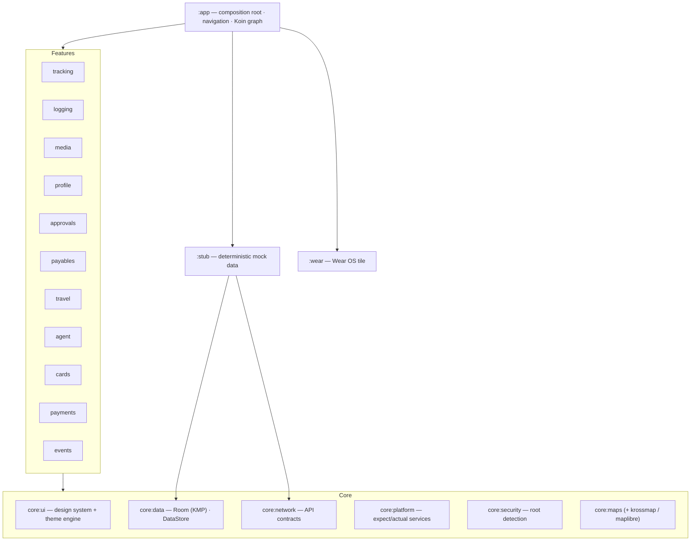

**Key patterns**

- **commonMain-first KMP** — core modules compile for Android + iOS (`iosArm64`, `iosSimulatorArm64`).
  Platform-bound tech (FusedLocation, CameraX, ML Kit, WorkManager, BiometricPrompt, foreground
  service) sits behind `expect`/`actual` interfaces in `:core:platform`, with Android and iOS impls.
- **Koin DI** — one module per feature; `InitKoin()` bootstrap is re-entrancy-safe for both the
  Android `Application` and the iOS entry point.
- **SearchProvider registry** — each feature binds a `SearchProvider` into Koin; the master-search
  module calls `getAll<SearchProvider>()` and fans out — zero coupling between search and features.
- **Shared scaffolds** — `FormSubmissionScaffold` and `HistoryListScaffold` standardise the create
  and history flows reused across travel / payables / payments / events.
- **Navigation** — type-safe JetBrains Compose Navigation with per-feature graphs assembled at `:app`.

### Module map

| Module | Responsibility |
|---|---|
| `:app` | Composition root, navigation host, Koin graph assembly, build flavors |
| `:core:ui` | Compose design system, theme engine (MaterialKolor), Canvas charts, shared scaffolds |
| `:core:data` | Room (KMP) database, DAOs, entities, DataStore repositories |
| `:core:network` | API contract & policy models (mocked) |
| `:core:platform` | `expect`/`actual` platform-service interfaces + Android/iOS impls |
| `:core:security` | Device-integrity (root) detection, encryption-ready storage |
| `:core:maps` / `-krossmap` / `-maplibre` | Map surface contract + flavor-specific implementations |
| `:core:common` | Shared utilities / primitives |
| `:feature:*` | tracking · logging · media · profile · approvals · payables · travel · agent · cards · payments · events |
| `:stub` | Deterministic mock data for every repository (no backend) |
| `:wear` | Wear OS companion tile |
| `build-logic` | Gradle convention plugins (centralised AGP/Kotlin/Compose config) |

## Build flavors

A `maps` flavor dimension splits the app into a proprietary and a FOSS build:

| Flavor | Maps | Google / Play / Firebase | Use case |
|---|---|---|---|
| `gms` | KrossMap (Google Maps / MapKit) | Firebase + Play services | Play Store build |
| `noGms` | MapLibre + offline MBTiles (no API key) | none — FOSS-clean | F-Droid / fully offline |

A dependency-prefix guard keeps proprietary libraries from leaking into the `noGms` classpath.

## Build & run

```bash
# Assemble (noGms is the offline-safe default)
./gradlew assembleNoGmsDebug          # FOSS / offline build
./gradlew assembleGmsDebug            # Google-services build

# Install on a device/emulator (API 30+)
adb install app/build/outputs/apk/noGms/debug/app-noGms-debug.apk
```

No network connection is required — all data is mock and persists locally via Room + DataStore.

**Offline check:** enable airplane mode, track a trip, kill and relaunch the app, and confirm the
record persisted.

## Testing & quality

```bash
./gradlew testNoGmsDebugUnitTest      # JVM unit tests (88 test classes, no emulator)
./gradlew recordRoborazziNoGmsDebug   # (re)record screenshot baselines → docs/screenshots/
./gradlew ktlintCheck detekt          # style + static analysis
./gradlew :app:koverXmlReport         # coverage report
```

> JVM/screenshot tests run on the **`noGms`** flavor — the `gms` flavor pulls in Google libraries that
> crash under Robolectric. CI (`.github/workflows/ci.yml`) runs `assembleGmsDebug` +
> `testNoGmsDebugUnitTest` on every push and PR.

## iOS & Wear OS

- **iOS** — all `:core:*` modules compile to an iOS framework (`baseName = "MileTracker"`), with
  `expect`/`actual` services backed by CoreLocation, Vision (OCR), UserNotifications, LocalAuthentication
  and BackgroundTasks. A few proprietary integrations (in-app update, install-referrer) are stubbed
  with `TODO(ios)` markers; the shared Compose UI renders through a minimal SwiftUI host.
- **Wear OS** — `:wear` ships a `MileageTileService` tile surfacing today's distance.

## The location engine

The tracking pipeline (GPS accuracy improved from ~50% → ~95% in production):

- **Jitter suppression** — stationary drift is filtered while the anchor point is preserved.
- **Spike detection** — an implied-speed check flags teleporting fixes without discarding them.
- **Four-bucket accounting** — `original / cleaned / abnormal / mock` are all persisted per track.
- **Mock-location flagging** — fraud is detectable, not merely blocked.
- **IMU fusion** — accelerometer + gyroscope snapshots feed post-hoc insight analyzers.

`SIMULATE_LOCATION = true` ships a simulated drive source that feeds believable fixes through the
exact same pipeline, so the full tracking flow works on an emulator with no GPS hardware.

---

<div align="center">
<sub>Mileway is a portfolio/demo project. All companies, bookings, cards and amounts are fictional mock data.</sub>
</div>
