<div align="center">


### Offline-first mileage, travel and expense tracking, built in Kotlin and Compose Multiplatform.

A standalone, offline-first app. It puts the location-engineering, offline-first and
multi-module architecture I care about into one place you can actually run.
Every screen still runs on deterministic mock data by default — a real Kotlin/Ktor backend now
exists too, sharing `:contract` DTOs with the client, off by default behind a flag.

[](https://github.com/darkpandawarrior/Mileway/actions/workflows/ci.yml)
[](https://github.com/darkpandawarrior/Mileway/actions/workflows/quality.yml)


-success)

**[Highlights](#highlights)** · **[Screenshots](#screenshots)** · **[Features](#features)** · **[Architecture](#architecture)** · **[Getting started](#getting-started)** · **[Roadmap](#roadmap)**

**Portfolio:** [cv-siddharth.vercel.app](https://cv-siddharth.vercel.app/) &nbsp;·&nbsp; **Sibling project:** [PaymentsLab](https://github.com/darkpandawarrior/PaymentsLab) &nbsp;·&nbsp; **Shared libraries:** [kmp-toolkit](https://github.com/darkpandawarrior/kmp-toolkit) &nbsp;·&nbsp; **Shared build logic:** [kmp-build-logic](https://github.com/darkpandawarrior/kmp-build-logic)

</div>

---

<details>
<summary><b>Table of contents</b></summary>

- [Why Mileway](#why-mileway)
- [Highlights](#highlights)
- [Screenshots](#screenshots)
- [Features](#features)
- [Architecture](#architecture)
  - [Engineering decisions](#engineering-decisions)
  - [Module map](#module-map)
  - [Project structure](#project-structure)
- [Tech stack](#tech-stack)
- [Getting started](#getting-started)
- [Build flavors](#build-flavors)
- [Ralph-loop development](#ralph-loop-development)
- [Testing and quality](#testing-and-quality)
- [Roadmap](#roadmap)
- [iOS, Wear OS and watchOS](#ios-wear-os-and-watchos)
- [The location engine](#the-location-engine)

</details>

<!-- AUTOGEN:stats -->
> **At a glance** — **34-module** clean architecture (12 feature · 12 core), Room schema **v48**, **155** host-rendered Roborazzi screenshots (JVM, no emulator). *Numbers auto-generated from `settings.gradle.kts` by `scripts/gen-readme.sh`.*
<!-- /AUTOGEN:stats -->

## Why Mileway

Mileway is a self-contained, offline-first mileage tracker. The whole thing still runs in airplane
mode: you track trips, log expenses, route approvals, and the data is there after a restart, reads
come from Room, and writes queue in a durable offline outbox. A real Kotlin/Ktor backend now exists
alongside it (`:server` + a shared `:contract` module) as an opt-in addon, not a replacement — it's
off by default (`NetworkBackendFlags.useRealBackend = false`), so the demo behavior above is
unchanged unless the flag is flipped.

I also use it as a reference for how I build Android and KMP apps. That means Compose Multiplatform,
a multi-module clean architecture, MVI-style unidirectional state, Koin for
DI, Room (KMP) with DataStore, and a `gms`/`noGms` flavor split so the same code ships to both the
Play Store and F-Droid.

Mileway doesn't stand alone. Its Gradle convention plugins live in a separate, reusable repo —
[**kmp-build-logic**](https://github.com/darkpandawarrior/kmp-build-logic), pulled in as a Gradle
`includeBuild` — so the AGP/Kotlin/Compose/test setup isn't copy-pasted per project but shared across
my KMP work. Its shared *libraries* increasingly come from the same place too:
[**kmp-toolkit**](https://github.com/darkpandawarrior/kmp-toolkit), a 36-module MIT Kotlin
Multiplatform toolkit vendored here as a git submodule. Mileway consumes **eight** of its modules —
`:mvi-core`, `:result`, `:common`, `:location`, `:offline-outbox`, `:security`, `:app-shell` and the
on-device `:ai` seam (multimodal + streaming) — rather than hand-rolling them, the "extract the
reusable core the moment a second app needs it, then consume it" philosophy in practice: Mileway is
both the flagship *and* a consumer. Its sibling,
[**PaymentsLab**](https://github.com/darkpandawarrior/PaymentsLab), goes deep on the payments/UPI
slice the same way this repo goes deep on location and offline-first. All three sit under the same
[portfolio](https://cv-siddharth.vercel.app/).

## Highlights

- 🛰️ **Real location engineering.** The tracking pipeline fights GPS jitter and recovers from spikes,
  with spike detection, four-bucket distance accounting, IMU fusion, device-tier-adaptive sampling
  and config-driven detection thresholds — and a deterministic recompute that re-derives history
  from persisted points when the math changes.
- 📴 **Offline-first, backend optional.** Room + DataStore stay the base data source for every
  screen; writes queue in a durable offline outbox and flush once online. It still runs fully in
  airplane mode either way.
- 🔗 **Kotlin/Ktor backend, opt-in (V33).** A real `:server` module (Ktor + Exposed) speaks the same
  `:contract` DTOs as the client, with idempotent location/event ingestion (`opId` dedup against a
  unique DB index) and the identical `PolicyRateEngine` computing reimbursement amounts on both
  sides. Off by default behind `NetworkBackendFlags.useRealBackend` — flipping it swaps the data
  source, not the domain logic.
- 🧩 **Multi-module clean architecture.** Feature modules never touch each other. They meet only at the
  `:app` composition root, wired through Koin.
- 🌍 **Kotlin Multiplatform — iOS live (V19).** All feature screens run on Android *and* iOS from
  `commonMain`. Background scheduling uses [kmpworkmanager](https://github.com/brewkits/kmpworkmanager)
  (BGTask dispatcher + AppDelegate); platform services sit behind `expect`/`actual`.
- 🔀 **One codebase, two distributions.** A `gms` Play build and a FOSS `noGms` / F-Droid build, with
  a dependency-prefix guard that fails the build the moment a proprietary library leaks into FOSS.
- 🧪 **Quality gates in CI.** A full Roborazzi/host-rendered screenshot suite on the JVM (no emulator,
  no network), Napier structured logging, detekt, ktlint and Kover, plus reproducible F-Droid
  release workflows.
- 🔥 **Ember theme, four platforms from one KMP core.** A warm amber/red dark theme (replacing an
  earlier phosphor-green look) skins Android/iOS phone, Wear OS, watchOS and Compose Desktop — all
  from the same `commonMain` architecture.
- 📄 **On-device document intelligence.** A capture-to-form pipeline combines on-device AI, text
  recognition and heuristics — OCR field-fill, doc-type classification and duplicate detection — on
  device where the platform supports it, degrading gracefully everywhere else.
- 🤖 **On-device LLM assistant.** The expense chat runs against a real on-device model behind a
  shared `LlmGateway` — ML Kit GenAI on Android, Apple Foundation Models on iOS via a Swift bridge
  (`xcodebuild`-gated, not device-verified) — degrading to the offline retrieval engine wherever no
  model is available. Not a stub response generator.

## Screenshots

> Every frame renders from deterministic mock data, recorded with
> [Roborazzi](https://github.com/takahirom/roborazzi) on the JVM — **no emulator, no device**.
> The journeys below are stitched from those host-rendered frames into animated flows with `ffmpeg`
> (`scripts/build-flow-gifs.sh`), so the showcase is everything *moving in synergy*, not a wall of
> stills. Regenerate the frames with `./gradlew :app:screenshotTestNoGmsDebug`.

<details>
<summary><b>📱 Phone — 11 animated end-to-end journeys</b> &nbsp;(click to expand)</summary>
<br/>

<table>
<tr>
<td width="50%" valign="top"><b>Super-profile &amp; personas</b><br/><sub>One account hub that reshapes itself — the Plugin manager toggles every feature per persona, so the same app becomes a different app.</sub><br/><br/>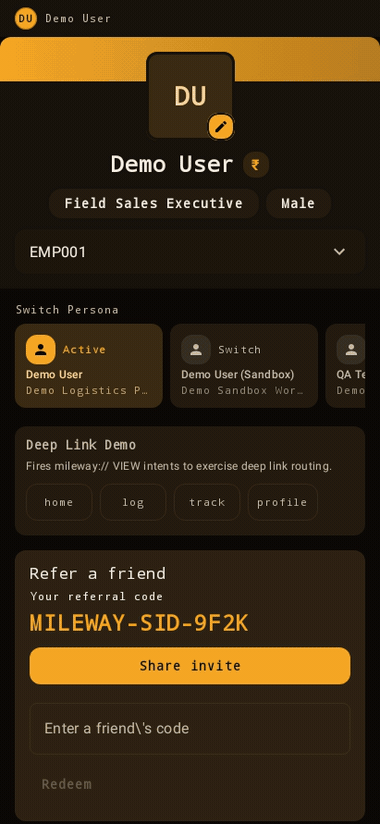</td>
<td width="50%" valign="top"><b>Track a trip</b><br/><sub>The core happy path: ready-to-start → setup guide → recording → success summary → submission.</sub><br/><br/>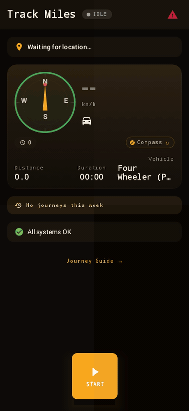</td>
</tr>
<tr>
<td valign="top"><b>Delegation — acting as a manager</b><br/><sub>Assign approver authority, then switch into the manager view to track the whole team's journeys.</sub><br/><br/></td>
<td valign="top"><b>Log &amp; expense</b><br/><sub>Manual entry: log miles across two steps, then capture an expense with category, policy and receipt.</sub><br/><br/>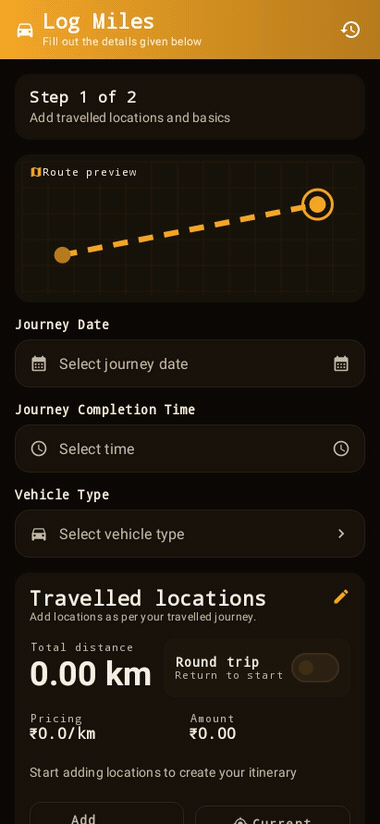</td>
</tr>
<tr>
<td valign="top"><b>Approvals &amp; payables</b><br/><sub>The approver side: pending queue with policy badges, a flagged detail, payables and purchase requests.</sub><br/><br/>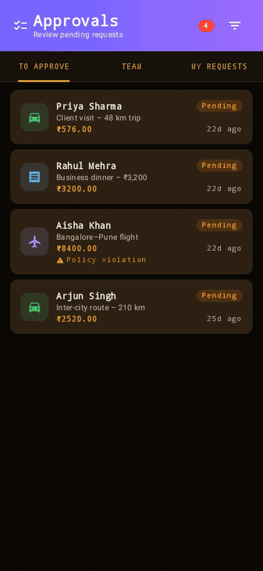</td>
<td valign="top"><b>Verification &amp; growth</b><br/><sub>Identity verification centre, referral hub, coupons, scratch-card rewards and the campaign marketing hub.</sub><br/><br/>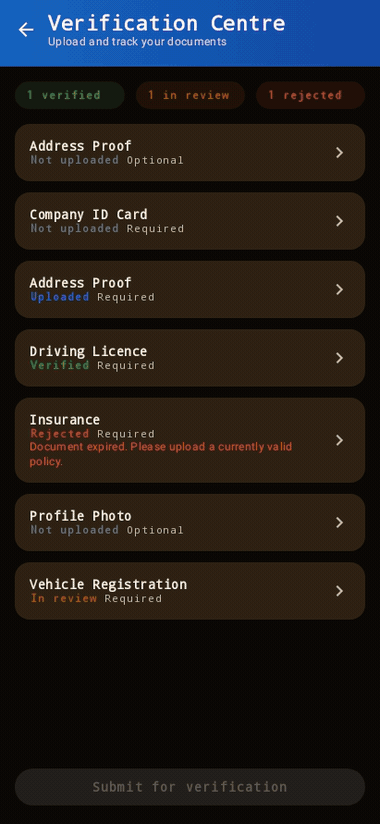</td>
</tr>
<tr>
<td valign="top"><b>Membership &amp; subscription</b><br/><sub>Mileway Club benefits, subscription plans, the active subscription and incentive programs.</sub><br/><br/></td>
<td valign="top"><b>AI assistant</b><br/><sub>On-device expense chat, saved history and question analytics behind a shared <code>LlmGateway</code>.</sub><br/><br/>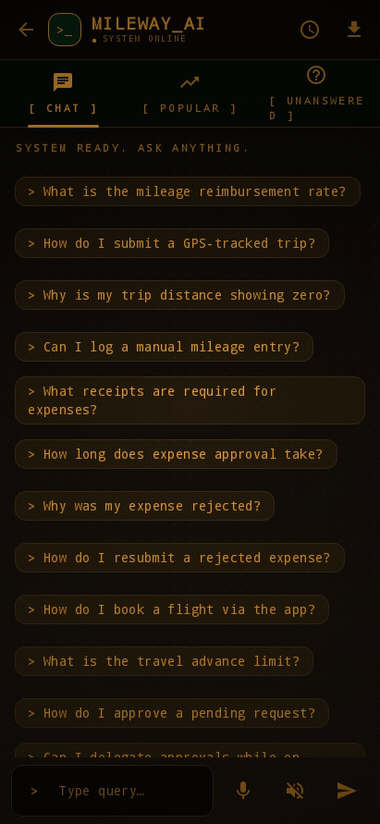</td>
</tr>
<tr>
<td valign="top"><b>Onboarding &amp; auth</b><br/><sub>First run: splash → login → signup onboarding → set a PIN → unlock.</sub><br/><br/></td>
<td valign="top"><b>Wallet &amp; payout</b><br/><sub>Connected accounts (per-integration connect/disconnect) and the QR scan-to-pay identity screen.</sub><br/><br/></td>
</tr>
<tr>
<td valign="top"><b>Account &amp; sessions</b><br/><sub>Active-device sessions with per-device revoke, the account-deletion lifecycle, saved places and emergency contacts.</sub><br/><br/>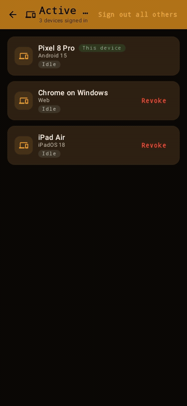</td>
<td valign="top"></td>
</tr>
</table>

</details>

<sub>The full still catalogue — every screen plus component matrices (status cards, booking cards,
PO cards, success-state variants, theme pickers) rendered from <code>@Preview</code> composables by
<code>ScreenshotCatalogTest</code> — lives in
<a href="docs/screenshots"><code>docs/screenshots/</code></a>. Full screens are recorded by
<code>ScreenshotGalleryTest</code> (phone) / <code>WearScreenshotGalleryTest</code> (watch) / a JVM
`desktopTest` (desktop).</sub>

<details>
<summary><b>⌚ Beyond the phone</b> — Wear OS · watchOS · Live Activity · Widgets · Compose Desktop &nbsp;(click to expand)</summary>
<br/>

One shared Kotlin Multiplatform core, rendered on every target — all host-side with Roborazzi /
SwiftUI `ImageRenderer`, no watch, launcher or windowing system required.

#### Wear OS

The watch app shares `commonMain`'s `SurfaceSnapshot`/`WearPresentation` mapping with the phone,
skinned with the same Ember accent via `WearMilewayTheme` (`androidx.wear.compose.material3` — its
own design system, never the phone/iOS CMP theming module).

| Dashboard | Recent trips |
|:---:|:---:|
| 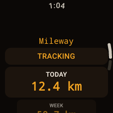 | 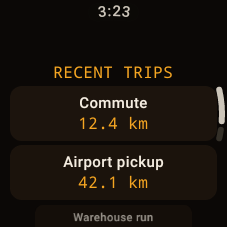 |

#### watchOS app

Native SwiftUI over the `:sharedWatch` KMP framework — today/week distance, a red live-tracking
pill and a trips drill-down.

| &nbsp; |
|:---:|
| 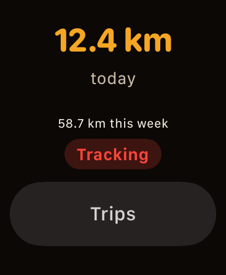 |

#### Live Activity & Dynamic Island

An ActivityKit Live Activity (Lock Screen banner) plus a Dynamic Island expanded presentation for an
in-progress trip, driven by the phone's `TrackingLiveActivityController`.

| Lock Screen banner | Dynamic Island (expanded) |
|:---:|:---:|
| 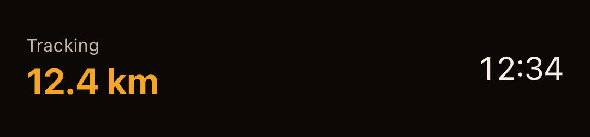 | 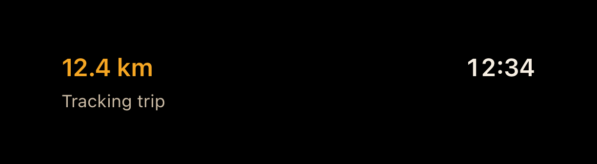 |

#### Widgets

**Android home-screen widget (Glance)** and **iOS WidgetKit** (home-screen + Lock Screen), both over
the same shared `SurfaceSnapshot` — today/week distance with a live "Tracking now" indicator and an
interactive App-Intent Start/Stop button on iOS.

| Android Glance | iOS home | iOS Lock Screen |
|:---:|:---:|:---:|
|  | 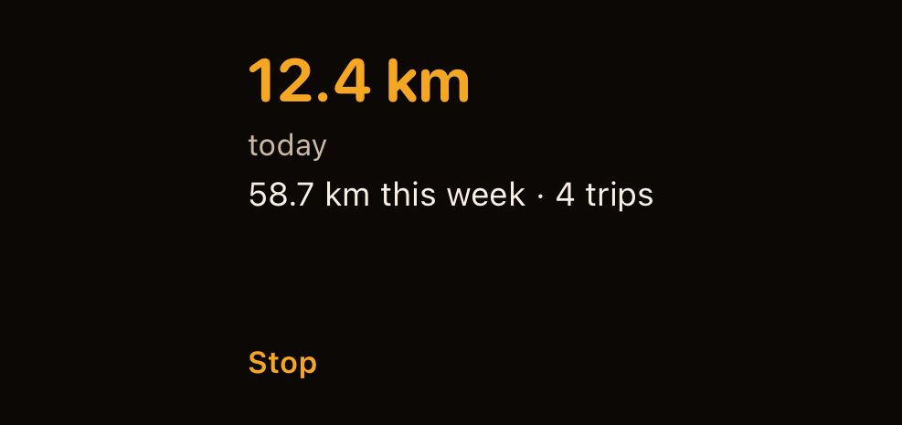 |  |

#### Compose Desktop

A curated gallery of the app's signature surfaces, all real Compose Desktop windows over the shared
`core:ui` component library and `core:data` models — no mockups, no Android/iOS emulator: every
image below is host-rendered JVM-side with Compose Multiplatform's `runDesktopComposeUiTest`.

| Dashboard | Live tracking | Trip history |
|:---:|:---:|:---:|
| 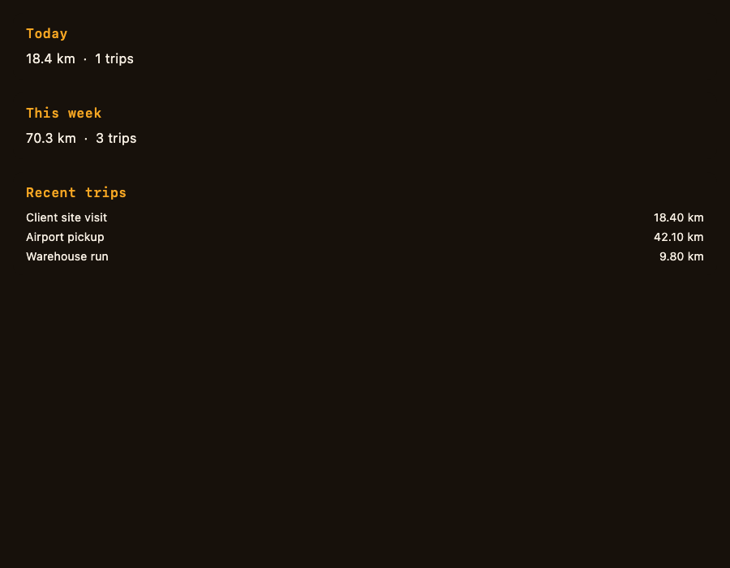 | 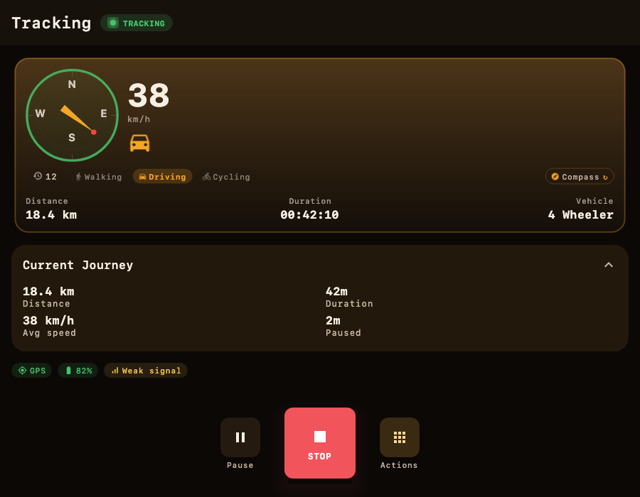 | 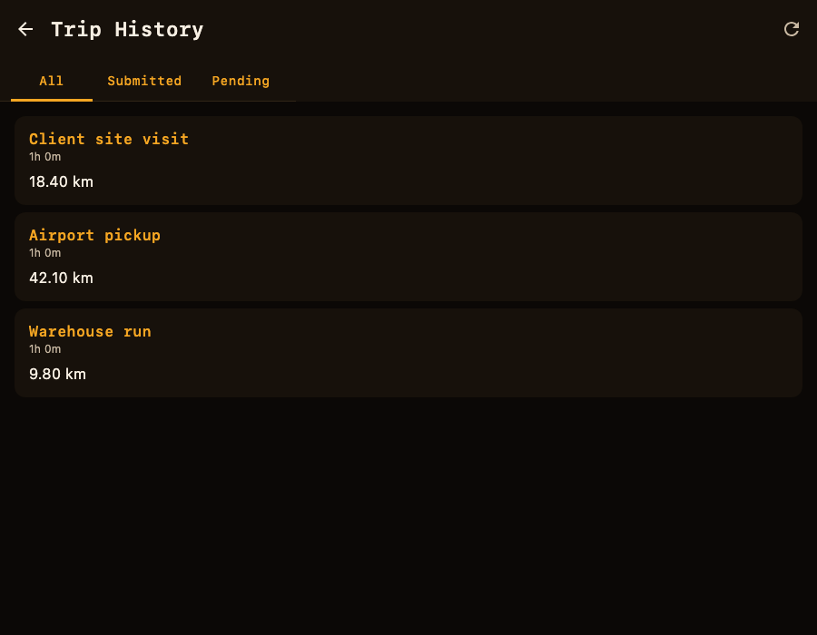 |

| Trip detail | Log expense | Approvals |
|:---:|:---:|:---:|
| 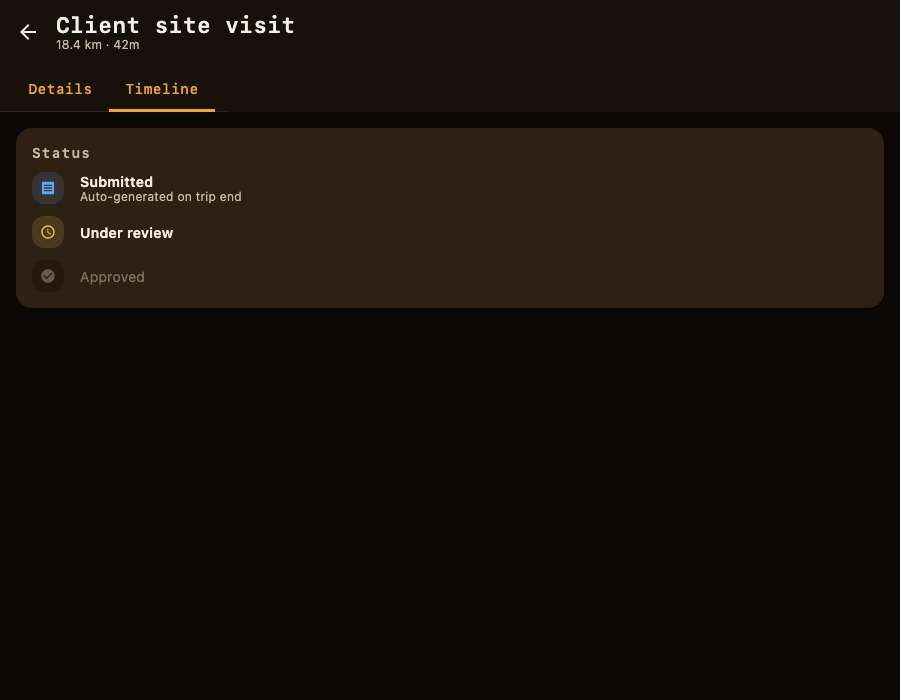 | 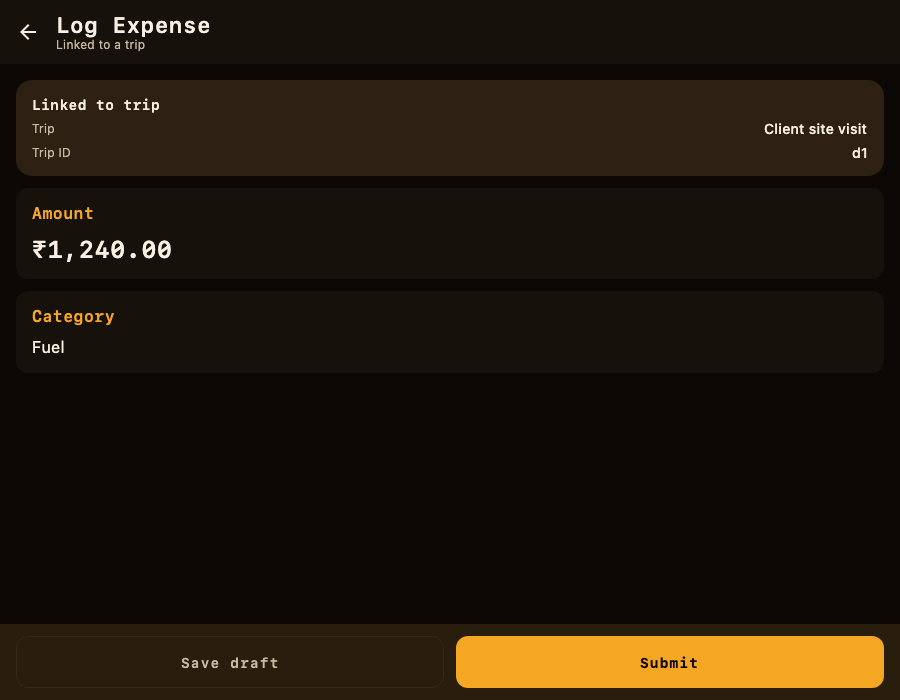 | 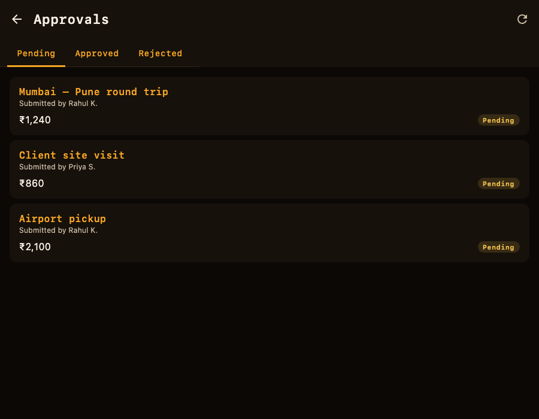 |

| Profile |
|:---:|
| 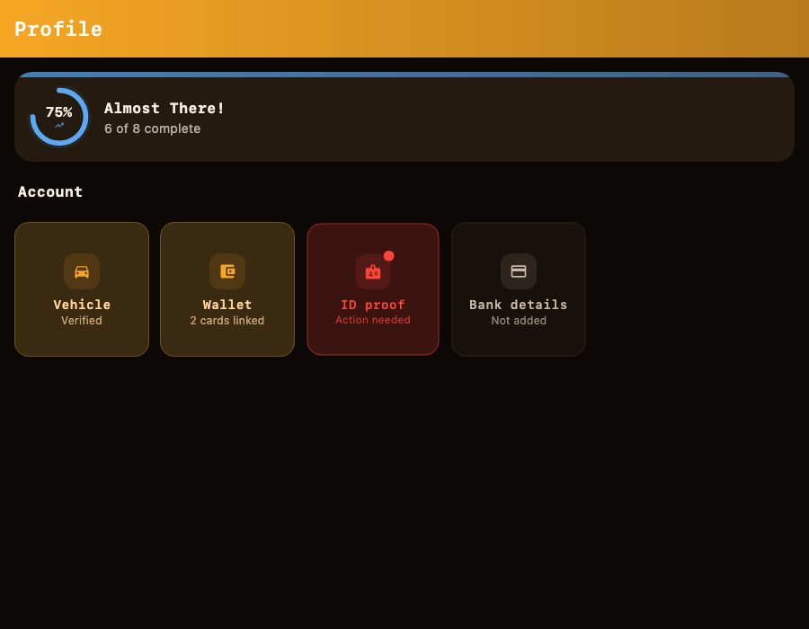 |

</details>

## Features

Every feature is fully interactive on mocked, offline data.

| Area | What's inside |
|---|---|
| **Tracking** | Live GPS trip tracking on a foreground service (jitter suppression, spike detection, four-bucket accounting, device-tier-adaptive sampling, config-driven abnormal detection); geofenced check-in with manual fallback; saved tracks (journey/submission tabs); trip insights; hardware-events log; multi-frame odometer OCR with typed start/end snapshots; multi-session restore of interrupted trips; a success screen with a policy-driven reimbursement amount; GPX / CSV / KML / GeoJSON **import &amp; export** plus Excel export. |
| **Logging &amp; Expenses** | Step-by-step manual trip logging backed by a durable Room submit-outbox (survives kill/relaunch); a 2-step add-expense wizard with entry-context linking (trip / card / advance / event / scanner), concurrent bulk submit and multi-currency; a shared policy rate engine for mileage reimbursement. |
| **Travel** | Travel hub, active-trip card (flight / train), upcoming bookings, plus trip &amp; booking history surfaces. |
| **Approvals &amp; Payables** | Approval queue with policy-violation badges; persistent clarification rooms with lifecycle/metadata/history and rich chat + attachments, shared across every transaction type via a common detail scaffold with comments, audit trail and action flags; payables hub, multi-step create-PR / invoice flows and history surfaces. |
| **Payments, Events &amp; Cards** | QR pay / request + history; event creation, history and rich event detail; card home / detail / request with KYC, QR, dispute and limits flows. |
| **Profile &amp; Account (super-profile, V24)** | Account hub, advance requests, Canvas-rendered analytics dashboards, an AI assistant sheet, notification centre, permission-health screen, MaterialKolor theme engine; **plus V24 depth:** verification centre + corporate-email/OTP verification, growth surfaces (referral, coupons, scratch rewards, campaigns), membership (Mileway Club, subscription plans, incentive programs), account-deletion lifecycle, enriched active-sessions, **act-on-behalf session delegation** with an app-wide "Acting as" banner, external **wallet linking via OTP**, **payout identity** (masked bank + editable UPI handle + QR), and a manager/reportee tracking view. |
| **Customization / personas (V24)** | A single **plugin registry** is the composition mechanism — every feature (tile, capability, tunable value) gates through it, resolved by layering FORCED &gt; USER &gt; PRESET &gt; DEFAULT. A **Master Plugin page** toggles any of them live with source chips; **persona presets** (Corporate Commuter, Super-App Consumer, Gig Driver, Minimal Guest) reshape the whole app — different hubs, auth flows, tracking behavior and tunable knobs — from one account. Tracking settings (accuracy/interval/displacement floors, force-GPS, sync toggles) are registry-backed and persisted, driving the live location engine. |
| **Backend &amp; sync (V33, opt-in)** | A Kotlin/Ktor `:server` module (Netty + Exposed, H2 by default) sharing `:contract` DTOs with the client; idempotent location/event ingestion (`opId` dedup on a unique index) and a `PolicyRateEngine` shared verbatim between server and client; a `JourneyValidator`/`DistanceValidator` validation layer; writes queue through a durable offline outbox and flush once online. Off by default (`NetworkBackendFlags.useRealBackend = false`) — the on-device `:stub` path is unchanged. |
| **Local dev &amp; infra** | A local analytics sink with a kill switch, a Ktor network-log + API-tester debug console, and a server-driven tracking config loaded from local JSON — all offline by default. |
| **Media &amp; document intelligence** | Unified capture (camera/gallery, CameraX flash/pinch-zoom/tap-focus, VNDocumentCamera scanner on iOS) behind one contract used by every call site; on-device document-intelligence pipeline — OCR field-fill, doc-type classification and duplicate detection, combining on-device AI, text recognition and heuristics and degrading gracefully where a model isn't available; QR / barcode scanning; real watermark burn-in; attachment grid. |
| **Dynamic forms** | A 16-field-type form engine driving expense/claim entry — validation, conditional visibility, GST auto-calc, and AI field suggestions from the document-intelligence pipeline. |
| **Master search** | A registry-based search that fans a query across five providers spanning every feature module. |
| **Analytics** | Filterable, trend-aware Canvas dashboards with export and a leaderboard view. |

## Architecture

Multi-module clean architecture. Feature modules never depend on one another; they meet only at the
`:app` composition root. State is unidirectional. Each screen exposes a single immutable state as a
`StateFlow`, collected with `collectAsStateWithLifecycle`, and a shared `ScreenState` wrapper models
the loading, empty, error and content cases.

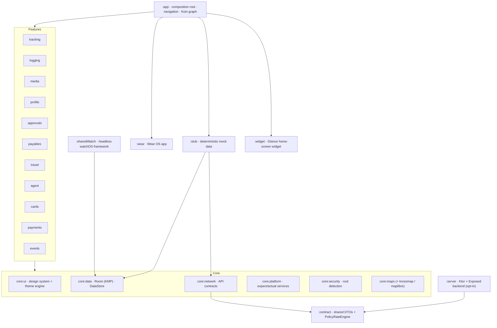

**Key patterns**

- **commonMain-first KMP.** Core modules compile for Android and iOS (`iosArm64`,
  `iosSimulatorArm64`). Platform-bound tech (FusedLocation, CameraX, ML Kit, WorkManager,
  BiometricPrompt, the foreground service) sits behind `expect`/`actual` interfaces in `:core:platform`.
- **Koin DI.** One module per feature, and the `InitKoin()` bootstrap is re-entrancy-safe for both the
  Android `Application` and the iOS entry point.
- **SearchProvider registry.** Each feature binds a `SearchProvider` into Koin. The master-search
  aggregator resolves `getAll<SearchProvider>()` and fans out, so search and the features stay decoupled.
- **Shared scaffolds.** `FormSubmissionScaffold` and `HistoryListScaffold` standardise the create and
  history flows that travel, payables, payments and events all reuse.
- **Navigation.** Type-safe JetBrains Compose Navigation, with per-feature graphs assembled at `:app`.
- **Opt-in backend, shared contract.** `:server` and the client both depend on `:contract` for
  request/response DTOs and the `PolicyRateEngine`, so the wire format and the reimbursement math
  can't drift between them. `NetworkBackendFlags.useRealBackend` (default `false`) is the single
  switch between `:stub`'s mock data and the real Ktor calls; writes queue through a durable offline
  outbox either way.

### Engineering decisions

The interesting part of a portfolio project isn't the feature list — it's the trade-offs. A few
choices here were deliberate, and each one closed off an easier alternative on purpose.

| Decision | Why | What it cost / trade-off |
|---|---|---|
| **`commonMain`-first KMP, platform tech behind `expect`/`actual`** | Business logic, state and UI written once and *proven* to compile for Android, iOS, Wear, watchOS and Desktop — not "Android code we might port later." The `expect`/`actual` seam is the discipline that keeps `android.*`/`java.*` from leaking into shared code. | You write to the intersection of platforms. Anything platform-bound (FusedLocation, CameraX, ML Kit, BiometricPrompt, WorkManager, the foreground service) needs a declared interface + an actual per target, which is more ceremony than a plain Android call. |
| **Offline-first as the base layer, real backend as an opt-in addon** | Room + DataStore stay the source of truth for every screen and the whole screenshot/test suite stays reproducible on the JVM with no live dependency — that was never going to change. What *did* change: a real Kotlin/Ktor `:server` now exists, sharing `:contract` DTOs with the client so the wire format can't drift, with the identical `PolicyRateEngine` computing reimbursement amounts on both sides. It's off by default (`NetworkBackendFlags.useRealBackend = false`), which is what "repositories already look network-shaped" was building toward — wiring the real API turned out to be a flag flip plus routes, not a rewrite. | The flag being off by default means most day-to-day usage still exercises mock data, not the live path; idempotent sync (`opId` dedup) and the offline-outbox flush are covered by dedicated Ktor/JVM tests rather than the full screenshot suite. Auth is explicitly deferred (every server call today is unauthenticated) — tracked as its own follow-up phase, not silently skipped. |
| **Location engine: four-bucket accounting + deterministic recompute** | GPS is dirty. Rather than throw away suspect fixes, every point is kept and classified into `original` / `cleaned` / `abnormal` / `mock` buckets, all persisted. Distance can then be *recomputed from the stored points*, so a later math fix re-derives history instead of stranding already-tracked trips on old numbers. | More storage and a more complex write path than "sum the deltas as they arrive." The payoff is auditability and forward-fixable math — the thing that actually matters when a user disputes a distance. |
| **MVI + single immutable state per screen** | One `StateFlow<State>` per screen, collected with `collectAsStateWithLifecycle`, wrapped in a shared `ScreenState` that models loading/empty/error/content uniformly. Renders are a pure function of state; there's no half-updated UI to reason about. | More boilerplate than mutable view state, and every field change means a fresh copy of the state object. Accepted because it makes recomposition predictable and screens trivial to screenshot-test. |
| **`SearchProvider` registry instead of a central search index** | Each feature binds its own `SearchProvider` into Koin; the master-search aggregator resolves `getAll<SearchProvider>()` and fans out. Adding a searchable feature is a one-line Koin binding — no edit to a shared switch statement, no feature-to-feature dependency. | Search is only as good as each provider, and cross-feature ranking is naive (per-provider, then merged). Fine for the scale here; the decoupling is worth more than global relevance tuning. |
| **One codebase, two distributions (`gms` / `noGms`) with a FOSS purity guard** | The same app ships to Play (Google Maps/Firebase via `gms`) and to F-Droid (MapLibre + offline MBTiles, zero proprietary deps via `noGms`). A dependency-prefix guard *fails the build* the instant a proprietary library reaches the `noGms` classpath — FOSS-clean is enforced, not hoped for. | Every platform integration needs a FOSS fallback (maps being the big one), and CI has to build/verify both flavors. The guard is what makes "it's really FOSS" a checkable claim rather than a README promise. |
| **Shared Gradle logic in a separate `includeBuild` repo** | The convention plugins live in [kmp-build-logic](https://github.com/darkpandawarrior/kmp-build-logic), not inlined here, so AGP/Kotlin/Compose/test config is reused across projects (PaymentsLab too) instead of drifting per-repo. | One more repo to keep in sync, and a composite build to reason about. Worth it the moment a second KMP project exists. |
| **Autonomous Ralph-loop development with a revert-on-uncommitted guard** | The app is built through versioned `.ralph/PLAN_Vxx.md` phases, each iteration editing → building → committing in one turn. A Stop hook reverts uncommitted tracked edits between turns, which *forces* small, self-contained, individually-revertable commits. | The workflow is unforgiving — a build that fails to commit in-turn is lost. That constraint is the point: it makes every change atomic and the history clean to bisect. |

### Module map

| Module | Responsibility |
|---|---|
| `:app` | Composition root, navigation host, Koin graph assembly, build flavors |
| `:core:ui` | Compose design system, theme engine (MaterialKolor), Canvas charts, shared scaffolds |
| `:core:data` | Room (KMP) database, DAOs, entities, DataStore repositories |
| `:core:network` | API contract &amp; policy models (mocked) |
| `:core:platform` | `expect`/`actual` platform-service interfaces + Android/iOS impls |
| `:core:security` | Device-integrity (root) detection, encryption-ready storage |
| `:core:maps` · `-krossmap` · `-maplibre` | Map-surface contract + flavor-specific implementations |
| `:core:common` | Shared utilities / primitives |
| `:core:media` | Unified capture contract (camera/gallery) + launcher, watermarking, odometer OCR orchestration |
| `:core:ai` | On-device document-intelligence pipeline — OCR field-fill, doc-type classification, duplicate detection, degrading gracefully without a model |
| `:core:forms` | Dynamic form engine — 16 field types, validation, conditional visibility, GST auto-calc |
| `:contract` | Shared request/response DTOs and `PolicyRateEngine`, depended on by both `:server` and the client (`:core:network`) so the wire format and reimbursement math can't drift between them |
| `:server` | Kotlin/Ktor backend (Netty + Exposed, H2 by default) — miles/location/event ingestion with idempotent `opId` dedup, plus JWT auth (`/api/auth/login` + `/refresh`) guarding every other route; opt-in, off by default in the client |
| `:feature:*` | tracking · logging · media · profile · approvals · payables · travel · agent · cards · advances (petty-cash + QR wallets) · payments · events |
| `:stub` | Deterministic mock data for every repository; the default data source while `NetworkBackendFlags.useRealBackend` is off |
| `:wear` | Wear OS app — dashboard, trip list/detail, tile, complication, ongoing activity, phone sync |
| `:sharedWatch` | Headless KMP static framework (no Compose) consumed by the native SwiftUI watchOS app |
| `:shared` | iOS umbrella framework — re-exports `core:ui`, `feature:tracking`, `feature:agent` and `feature:logging` as the single `Mileway.framework` Xcode links against |
| `:widget` | Glance home-screen widget (mileage summary + quick start/stop) |
| `:baselineprofile` | Macrobenchmark module generating the Baseline Profile via `:app:generateNoGmsReleaseBaselineProfile` |
| `build-logic` | Gradle convention plugins (centralised AGP / Kotlin / Compose config) |

### Project structure

```text
Mileway/
├── app/                      # Android application: composition root, navigation, DI, flavors
├── core/
│   ├── ui/                   # Compose design system, theme engine, shared scaffolds
│   ├── data/                 # Room (KMP) + DataStore
│   ├── network/              # API contracts (mocked)
│   ├── platform/             # expect/actual platform services
│   ├── security/             # root detection, encryption-ready storage
│   ├── maps/ maps-krossmap/ maps-maplibre/   # map-surface contract + impls
│   ├── common/                # shared utilities
│   ├── media/                 # unified capture contract + launcher, watermarking, OCR orchestration
│   ├── ai/                    # on-device document-intelligence pipeline
│   └── forms/                 # dynamic form engine (16 field types, validation, GST)
├── contract/                 # shared DTOs + PolicyRateEngine (client + server)
├── server/                   # Kotlin/Ktor backend (Netty + Exposed) — opt-in, off by default
├── feature/                  # tracking · logging · media · profile · approvals
│                             # payables · travel · agent · cards · payments · events
├── stub/                     # deterministic mock data for every repository
├── wear/                     # Wear OS app (dashboard, trip list/detail, tile, complication)
├── sharedWatch/              # headless KMP framework for the native SwiftUI watchOS app
├── shared/                   # iOS umbrella framework (re-exports core:ui, feature:tracking, feature:agent, feature:logging)
├── widget/                   # Glance home-screen widget + quick start/stop
├── baselineprofile/          # macrobenchmark module for Baseline Profile generation
├── build-logic/              # Gradle convention plugins
├── docs/                     # README assets, screenshots, release & brand docs
└── fastlane/                 # store metadata + screenshots
```

## Tech stack

| Layer | Technology |
|---|---|
| Language | Kotlin **2.4.20-Beta1** |
| UI | Compose Multiplatform **1.12.0-beta02**, Material 3 |
| Build | AGP **9.4.0-alpha04**, Gradle **9.7.0-milestone-3**, KSP **2.3.10**, Gradle Kotlin DSL, convention plugins, version catalog |
| DI | Koin **4.2.2** (multiplatform) |
| Database | Room **2.8.4** (KMP, bundled SQLite) |
| Settings / session | AndroidX DataStore |
| Networking | Ktor **3.5.1** client (OkHttp + Darwin engines) + Ktor server (Netty + Exposed, H2 by default) — the real backend is opt-in behind `NetworkBackendFlags.useRealBackend` (default `false`); `:stub` is the default data source |
| Concurrency | Coroutines + Flow (no LiveData); `kotlinx-datetime` **0.8.0** in commonMain |
| Navigation | compose-nav-graph-annotations **0.2.1** |
| Maps | osmdroid / MapLibre (`noGms`, offline MBTiles) · KrossMap (`gms`) |
| Charts | Canvas-only (no MPAndroidChart / Vico) |
| Theming | MaterialKolor **5.0.0** |
| Capture | Peekaboo (KMP camera/gallery) |
| On-device AI | ML Kit GenAI (Android) / Apple Foundation Models (iOS, Swift-bridge) behind a shared `LlmGateway`, text recognition + barcode scanning, degrading to an offline heuristic engine where a model isn't available |
| Testing | JUnit, MockK, Turbine, Robolectric, Koin-Test, **Roborazzi 1.68.0** screenshots |
| Quality | detekt **2.0.0-alpha.5**, ktlint, Kover, dependency-guard |
| SDK | compileSdk **37**, minSdk **30**, JDK 21 |

## Getting started

**Prerequisites:** JDK 21+ (CI builds on 25), the Android SDK (API 35), and — for iOS/watchOS
targets — a Mac with Xcode 16+. Point Gradle at your SDK via `local.properties`
(`sdk.dir=/path/to/Android/sdk`) or the `ANDROID_HOME` env var.

**Clone with submodules.** The Gradle convention plugins ([kmp-build-logic]) and the shared
libraries ([kmp-toolkit]) live under `external/` as git submodules, pulled into the build with
`includeBuild`. A plain clone leaves them empty and the build fails with *"Included build
'external/kmp-build-logic' does not exist"* — so recurse:

```bash
git clone --recurse-submodules https://github.com/darkpandawarrior/Mileway.git
cd Mileway
# already cloned without --recurse-submodules? pull them in:
git submodule update --init --recursive

# Assemble the offline-safe default build
./gradlew assembleNoGmsDebug

# Install on a device/emulator (API 30+)
adb install app/build/outputs/apk/noGms/debug/app-noGms-debug.apk
```

No network connection is required. The data is all mock and persists locally through Room and
DataStore. A real Kotlin/Ktor backend ships too but is **off by default** — see
[Build flavors](#build-flavors) and the `:server` notes below to opt in.

[kmp-build-logic]: https://github.com/darkpandawarrior/kmp-build-logic
[kmp-toolkit]: https://github.com/darkpandawarrior/kmp-toolkit

> **Offline check:** enable airplane mode, track a trip, kill and relaunch the app, and confirm the
> record persisted.

<details>
<summary><b>All build &amp; tooling commands</b></summary>

```bash
# Build variants
./gradlew assembleNoGmsDebug          # FOSS / offline build (default)
./gradlew assembleGmsDebug            # Google-services build
./gradlew assembleNoGmsRelease        # reproducible FOSS release (F-Droid)

# Tests & screenshots (noGms only; gms crashes Robolectric)
./gradlew testNoGmsDebugUnitTest      # JVM unit tests (300+ test classes, no emulator)
./gradlew recordRoborazziNoGmsDebug   # (re)record screenshot baselines → docs/screenshots/

# Quality
./gradlew ktlintCheck detekt          # style + static analysis
./gradlew :app:koverXmlReport         # coverage report

# Backend (opt-in — off by default)
./gradlew :server:run                 # start the Ktor server on :8080 (H2 in-memory)
./gradlew :server:test                # server route / auth / opId-dedup tests
# then set NetworkBackendFlags.useRealBackend = true and point BaseUrlProvider at the server
# (Android emulator: http://10.0.2.2:8080). Auth: POST /api/auth/login with the seeded demo user.

# Other targets
./gradlew :desktopApp:assemble        # Compose Desktop
./gradlew :wear:assembleNoGmsDebug    # Wear OS
./gradlew :shared:compileKotlinIosSimulatorArm64  # iOS (compile check; run via Xcode/iosApp)
```

</details>

## Build flavors

A `maps` flavor dimension splits the app into a proprietary and a FOSS build:

| Flavor | Maps | Google / Play / Firebase | Use case |
|---|---|---|---|
| `gms` | KrossMap (Google Maps / MapKit) | Firebase + Play services | Play Store build |
| `noGms` | MapLibre + offline MBTiles (no API key) | none (FOSS-clean) | F-Droid / fully offline |

A dependency-prefix guard fails the build if proprietary libraries leak into the `noGms` classpath.

## Ralph-loop development

This repo is built and evolved almost entirely through autonomous Ralph-loop iteration
(`.ralph/PLAN.md` plus versioned plans `PLAN_V3` … `PLAN_V20`, each one migration phase — KMP
hoisting, iOS parity, the AI assistant rebuild, etc.). Progress is tracked per iteration in
`.ralph/PROGRESS.md`.

- **Verification gate (current, flavored build):**
  ```bash
  ./gradlew assembleNoGmsDebug && ./gradlew testNoGmsDebugUnitTest
  ```
  (the `gms` flavor crashes Robolectric, so unit tests only run on `noGms`.)
- **Guardrail:** the Ralph Stop hook reverts uncommitted *tracked* edits between turns — each
  iteration must edit, build/test, and commit within the same turn, or the change is lost.
- Historical note: earlier plan revisions reference the original, pre-flavor bootstrap commands
  `assembleDebug` / `testDebugUnitTest` from when this repo was a bare single-variant extraction of
  the mileage feature; those tasks are long complete and the flavored commands above are what CI
  and current Ralph runs actually use.

## Testing and quality

- **JVM unit tests.** 300+ test classes covering ViewModels, repositories and feature logic with MockK
  and Turbine, run on the `noGms` flavor with no emulator.
- **Screenshot tests.** Roborazzi renders every screen across all feature modules plus the
  component-preview matrices on the JVM (`ScreenshotGalleryTest` and `ScreenshotCatalogTest`, all
  in `docs/screenshots/`). They're deterministic and diff cleanly in PRs.
- **Static analysis.** detekt and ktlint across every module, with Kover for coverage.
- **Backend tests (`:server`).** `./gradlew :server:test` covers idempotent `opId`
  dedup, the shared `PolicyRateEngine`, and route behavior against an in-memory H2 database — a
  plain `kotlin("jvm")` module, not part of the KMP/Android build. Runs in `ci.yml` on every push
  and PR (it's outside `testNoGmsDebugUnitTest`, so it has its own step).
- **CI.** `.github/workflows/ci.yml` runs `assembleGmsDebug`, `testNoGmsDebugUnitTest`,
  `testAndroidHostTest` and `:server:test` on every push
  and PR. Separate `quality`, `release` and `publish-fdroid` workflows handle the gates and distribution.
- **Distribution.** Beyond Play/F-Droid/Indus (`release.yml`, `publish-fdroid.yml`, `indus-deploy.yml`):
  `amazon-appstore-deploy.yml`, `huawei-appgallery-deploy.yml`, `samsung-galaxy-store-deploy.yml`, and
  `aptoide-deploy.yml` cover the other major Android storefronts, all gated on repo secrets and inert
  until configured (see each workflow's header comment). GitHub Releases (already published by
  `release.yml`) also make the app trackable via [Obtainium](https://github.com/ImranR98/Obtainium)
  with no extra config. **Uptodown** has no public submission API — manual web-form upload only.

## Roadmap

A snapshot of where Mileway is and where it's heading. This is a portfolio/demo project, so the
roadmap reflects direction rather than commitments.

**Shipped**

- [x] Offline-first app on deterministic mock data (no backend calls by default; see V33 below)
- [x] Multi-module clean architecture with Koin DI
- [x] Compose Multiplatform UI; `commonMain` core compiles for Android + iOS
- [x] `gms` / `noGms` flavor split + FOSS dependency-prefix guard
- [x] Room (KMP) + DataStore persistence
- [x] Location engine (jitter / spike / four-bucket / IMU fusion) with a simulated drive source
- [x] Master search: a registry across feature modules with an aggregator, results screen and navigation
- [x] Roborazzi/host-rendered screenshot suite (JVM-only, no emulator), detekt / ktlint / Kover, CI + release workflows
- [x] Wear OS companion tile
- [x] **iOS UI parity (V19).** All feature screens in `commonMain`; background scheduling via
      kmpworkmanager; AppDelegate + BGTask dispatcher; iOS builds and passes all CI gates.
- [x] Napier structured logging across all modules
- [x] **AI assistant / "agent" feature (V20).** Offline, retrieval-grounded chat over real local
      trip/expense/card data; Room-backed persistent history + 5-minute session resume; on-device
      voice I/O (STT/TTS); feedback, export and real-usage popular-question ranking; full
      `commonMain` + iOS parity. (A dedicated Popular/Unanswered analytics screen and persisted
      unanswered-question submission are still open — tracked as backlog.)
- [x] **On-device LLM backing (post-V25).** `LlmGateway` swaps the assistant onto a real on-device
      model — ML Kit GenAI on Android, Apple Foundation Models on iOS (Swift bridge,
      `xcodebuild`-gated, not yet device-verified) — degrading to the offline retrieval engine
      wherever no model is available.
- [x] Matrix / terminal design-language pass across the whole UI (theme tokens, topbar, screenshots)
- [x] Renamed the project and package from MileTracker(Demo) to Mileway end-to-end
- [x] **Multi-account depth (V22).** Room-backed multi-persona account store with a real
      switch-account mechanism, PIN/biometric gate, and per-account session isolation (trip/expense
      queries re-scoped, cross-persona cold-start reconciliation).
- [x] **Profile / Settings depth (V22).** Room-backed approval delegation, a full Active Sessions
      screen (per-device revoke), a real local Notification Centre with unread counts and channel
      toggles, connected-account integration toggles, real permission-state checks, and a local
      support-ticket flow (My Tickets) with video tutorials.
- [x] **Login / onboarding depth (V22).** Staged sign-in loading states, a demo-mode persona picker,
      an app-wide local PIN gate (set/check with biometric fallback), and a welcome disclaimer sheet
      requesting real location/notification permissions before first use.
- [x] **Watch platform build-out (V23).** Shared `SurfaceSnapshot`/`WatchSyncPayload` domain contract
      in `core:data`; a full Wear OS app (dashboard, trip list/detail, tile, complication, ongoing
      activity, phone→watch `DataClient` sync); a native SwiftUI watchOS app over the new headless
      `:sharedWatch` KMP framework with two-way `WatchConnectivity` sync; Android Glance widget +
      App Shortcuts + Quick Settings tile + AppFunctions; iOS WidgetKit widgets, Live Activity/Dynamic
      Island, and App Intents/Siri Shortcuts; an accessibility sweep across every new surface on both
      platforms.
- [x] **Feature-parity &amp; tracking-engine depth wave.** A policy-driven reimbursement rate engine and
      a tracking success screen; device-tier-adaptive sampling, config-driven abnormal detection,
      multi-frame odometer OCR with typed snapshots (Room migration to v18) and deterministic distance
      recompute; GPX/CSV/KML/GeoJSON import + Excel export; a durable Room submit-outbox for manual
      logging; offline sync scaffolding (local-data flagging + multi-session restore); and local-only
      dev infra — an analytics sink with kill switch, a Ktor network-log/API-tester console, and a
      server-driven tracking config loaded from local JSON. All offline/mock, no backend.
- [x] **Super-profile &amp; plugin-composition platform (V24).** A single **plugin
      registry** as the app's composition mechanism (TILE / CAPABILITY / VALUE plugins resolved by
      layering FORCED &gt; USER &gt; PRESET &gt; DEFAULT), a live Master Plugin page with source chips, and
      four **persona presets** that reshape the whole app from one account. On top of it: auth depth
      (phone login, MFA, OTP-via-call), signup onboarding + what's-new, profile depth (OTP phone
      change, email/corporate verification, avatar, saved places, emergency contacts), a verification
      centre + card KYC, growth (referral, coupons, scratch rewards, campaigns), membership (Mileway
      Club, subscription plans, incentive programs), account-deletion lifecycle + enriched sessions,
      **act-on-behalf session delegation** (app-wide "Acting as" banner, trip-ownership isolation),
      external **wallet linking via OTP**, **payout identity** (masked bank + editable UPI handle +
      QR), and registry-backed **tracking-settings persistence** (accuracy/interval/displacement
      floors, force-GPS, mileage-sync toggles) wired into the live location engine, plus a
      manager/reportee tracking view, a vehicle garage &amp; rates, destination mode, an ecometer, an
      engagement/trust hub, a unified priority banner system, and a reorganized super-profile hub.
- [x] **On-device intelligence &amp; feature-parity series (V25→V32).** Three new foundation modules —
      `core:media` (unified capture), `core:ai` (document intelligence) and `core:forms` (dynamic
      forms) — under an on-device OCR pipeline that combines ML Kit GenAI / text-recognition /
      heuristics on Android and Foundation Models / Vision on iOS (field-fill + doc-type + duplicate
      detection, degrading gracefully). On top: one capture launcher (camera / gallery / files / PDF /
      document-scanner / QR-barcode + watermark) that all seven legacy call sites converge on; a
      16-type dynamic form engine with GST auto-calc and AI field-suggestions; a 2-step add-expense
      wizard with entry-context linking, concurrent bulk-submit and multi-currency; a shared
      transaction-detail scaffold with persistent clarification rooms (lifecycle, metadata, history,
      rich chat + attachments), comments and audit flags; feature depth across search, analytics,
      events, cards and home; a shell-nav fix, shake-to-report and a storage-management screen; and
      Room schema **v39 → v47** across explicit migrations.
- [x] **Kotlin/Ktor backend, opt-in (V33).** A real `:server` module (Ktor + Exposed, H2 by default)
      alongside a shared `:contract` module for request/response DTOs and the `PolicyRateEngine`, so
      server and client can't drift on wire format or reimbursement math; idempotent location/event
      ingestion (`opId` dedup against a unique DB index); a `JourneyValidator`/`DistanceValidator`
      validation layer; writes queued through a durable offline outbox and flushed once online.
      Off by default behind `NetworkBackendFlags.useRealBackend` — offline-first (Room + DataStore,
      `:stub`) stays the base, the backend is an addon, not a replacement. Auth is explicitly
      deferred to a follow-up phase (every server call today is unauthenticated).
- [x] **iOS launch-crash fix (V33).** `CADisableMinimumFrameDurationOnPhone` added to `Info.plist`
      (a Compose Multiplatform `PlistSanityCheck` requirement) — the iOS app builds
      (`xcodebuild`-green) and launches correctly on device.

**Exploring**

- [ ] Baseline Profiles real on-device generation (device-gated; static profile ships today)
- [ ] Instrumented (on-device) UI test tier alongside the JVM suite
- [ ] Larger bundled offline map packs
- [ ] Expand Roborazzi catalog to remaining edge-case states
- [ ] watchOS live device verification, AppFunctions ADB invocation, Siri phrase invocation — all
      compile/build-verified here, pending real-device/simulator-runtime confirmation
- [ ] Live iOS-**simulator** app-content rendering — currently blocked by an upstream Compose
      Multiplatform/Skiko ↔ Xcode 26 / iOS 26 simulator Metal issue (works on physical devices); the
      shared CMP UI is represented in this README by the Android catalog and the Compose Desktop
      gallery instead. iOS itself is `xcodebuild`-green and device-verified for launch.
- [ ] `:server` auth (every route today is a bare, unauthenticated call — deferred to its own phase,
      not skipped silently); the remaining PLAN_V33.1 routes beyond miles/location/events

## iOS, Wear OS and watchOS

- **iOS.** Every `:core:*` module compiles to an iOS framework, with `expect`/`actual` services
  backed by CoreLocation, Vision (OCR), UserNotifications, LocalAuthentication and BackgroundTasks.
  A few proprietary integrations (in-app update, install-referrer) are stubbed with `TODO(ios)`
  markers, and the shared Compose UI renders through a minimal SwiftUI host. Home/Lock Screen
  WidgetKit widgets, a Live Activity/Dynamic Island for active tracking, and App Intents/Siri
  Shortcuts (start/stop/log) round out the iOS surface, all reading the same offline
  `SurfaceSnapshot`/`WatchFacade` seam as the phone app.
- **Wear OS.** `:wear` is a full Compose-for-Wear-OS app: a `ScalingLazyColumn` dashboard (today/week
  distance, tracking state, goal progress), trip list + detail, a real tile and complication backed
  by the shared snapshot, an ongoing activity wired to live tracking, and a phone→watch `DataClient`
  sync (gms flavor only; noGms stays FOSS-pure).
- **watchOS.** A native SwiftUI app (`iosApp/MilewayWatch`) over `:sharedWatch`, a headless KMP
  static framework exposing the same domain facade with no Compose/UI dependency — dashboard, trip
  list, and two-way `WatchConnectivity` sync with the iPhone app. Built via XcodeGen
  (`iosApp/project.yml`); verified with `xcodebuild`, not the Gradle gate.
- **Both watch platforms** share one commonMain contract: `SurfaceSnapshot` (trip stats) and
  `WatchSyncPayload`/`WatchSyncBridge` (the serializable phone↔watch wire format) live in
  `core:data`, so Wear's `DataClient` push and watchOS's `WatchConnectivity` session drive off the
  identical shared model — no per-platform reimplementation of the sync contract.

**Verification status by surface** (what's gate-verified here vs. pending real hardware):

| Surface | Build/compile | Automated tests | Live/device verification |
|---|---|---|---|
| Wear OS app (dashboard, trips, tile, complication, ongoing activity) | ✅ `assembleNoGmsDebug`/`assembleGmsDebug` | ✅ `testNoGmsDebugUnitTest` (incl. host-rendered Roborazzi screenshots) | ⏸ on-watch GPS verification only |
| Phone→watch DataLayer sync (gms) | ✅ compiles, FOSS-purity guard passes | ✅ unit-tested | ⏸ needs a paired physical/emulated Wear device |
| watchOS app (SwiftUI + `:sharedWatch`) | ✅ `xcodebuild … -scheme MilewayWatch build` | ✅ host-rendered screenshot (WatchScreenshotTests) | ✅ dashboard captured |
| WatchConnectivity sync (iOS ↔ watchOS) | ✅ compiles both schemes | — | ⏸ needs a live paired simulator/device session |
| Android Glance widget + quick start/stop | ✅ `assembleNoGmsDebug` | ✅ `MileageSummaryWidgetTest` | — (in-process Glance render, no home-screen manual check done here) |
| Android App Shortcuts / Quick Settings tile / AppFunctions | ✅ compiles | ✅ unit-tested | ⏸ AppFunctions invocation needs `adb shell` on an API-36 emulator (device-gated) |
| iOS WidgetKit + Live Activity/Dynamic Island | ✅ `xcodebuild -scheme MilewayWidgets build` | ✅ host-rendered screenshots (WidgetScreenshotTests) | ✅ widgets + Live Activity captured |
| iOS App Intents / Siri Shortcuts | ✅ compiles, `AppShortcutsProvider` registered | — | ⏸ Siri phrase invocation needs a device/simulator with Siri running |
| Compose Desktop dashboard | ✅ `:desktopApp:desktopMain` compiles | ✅ `desktopTest` (host-rendered screenshot) | — (pure-JVM, no separate device verification needed) |
| Accessibility sweep (Android + iOS/watchOS surfaces) | ✅ compiles | — | ⏸ manual VoiceOver/TalkBack walkthrough documented inline; no automated a11y audit target yet |

## The location engine

The tracking pipeline is built to suppress jitter and recover from GPS spikes:

- **Jitter suppression.** Stationary drift gets filtered out while the anchor point is preserved.
- **Spike detection.** An implied-speed check flags teleporting fixes instead of silently dropping them.
- **Four-bucket accounting.** `original`, `cleaned`, `abnormal` and `mock` are each persisted per track.
- **Mock-location flagging.** Spoofing is detectable, not just blocked.
- **IMU fusion.** Accelerometer and gyroscope snapshots feed the post-hoc insight analyzers.
- **Device-tier-adaptive sampling.** Location cadence and analysis depth scale to the device's tier,
  so low-end hardware isn't overwhelmed while high-end devices get full fidelity.
- **Config-driven abnormal detection.** Spike / teleport thresholds come from one tunable config
  object (locally overridable), not magic numbers scattered through the pipeline.
- **Deterministic DB-recompute.** Distance buckets can be recomputed from the persisted points, so a
  math fix re-derives history instead of stranding already-tracked trips on the old numbers.

Set `SIMULATE_LOCATION = true` and a simulated drive source feeds believable fixes through the exact
same pipeline, so the whole tracking flow works on an emulator with no GPS hardware.

---

<div align="center">

**[Portfolio](https://cv-siddharth.vercel.app/)** &nbsp;·&nbsp; **[PaymentsLab](https://github.com/darkpandawarrior/PaymentsLab)** (sibling KMP project) &nbsp;·&nbsp; **[kmp-build-logic](https://github.com/darkpandawarrior/kmp-build-logic)** (shared convention plugins)

<sub>Mileway is a portfolio / demo project. All companies, bookings, cards and amounts are fictional mock data.</sub>
</div>
