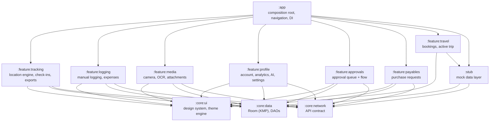

# MileTracker Demo

A production-grade standalone offline mileage-tracking and expense-management demo app built with **Compose Multiplatform** — demonstrating the location-engineering, offline-first, and multi-module architecture patterns I use in production apps serving 50k+ MAU.

## Features

All screens are fully functional with deterministic mock data — no network calls required.

**Tracking**
- Live GPS trip tracking with foreground service, jitter suppression, spike detection, and four-bucket distance accounting (`original / cleaned / abnormal / mock`)
- Geofenced check-in with manual fallback, check-in history with timeline view
- Saved tracks: journey/submission tabs, date-grouped cards, multi-select, voucher creation
- Track detail, trip insights, hardware events log, GPX/CSV/KML/GeoJSON export

**Logging & Expenses**
- Manual trip logging (step-by-step location search, verify-distance dialog)
- Expense entry → detail → success chain with category selection
- Expense history with filter chips

**Travel**
- Travel hub with teal gradient header, summary metrics strip
- Active trip card (flight PNQ→BOM, IndiGo 6E-401, boarding pass, ON TIME chip)
- Upcoming bookings list (3 entries: flights + train)
- Quick-action buttons, travel policy reminder card

**Approvals & Payables**
- Approvals queue with policy-violation badges, approval/rejection flow, seek-clarification sheet
- Payables hub, create purchase request (2-step with category dropdown + quantity stepper), PO detail

**Profile & Account**
- Account hub with 9-tile grid, profile completion ring (72%)
- Advance history, ask-advance multi-step form (auto-approves < ₹10k)
- Cards home, card detail (block/unblock dialog), card request (KYC-lite)
- Analytics dashboard (Canvas bar chart, stacked category bar, compliance ring)
- Analytics detail per category (Canvas bezier line chart, merchant table)
- AI Assistant bottom sheet with pre-seeded Q&A and simulated typing delay

**Notifications**
- Notification centre with 8 deterministic entries, filter chips (ALL/UNREAD/APPROVALS/SYSTEM)
- Per-type icon colours, unread dot indicator, mark-all-read action

**Settings & Permissions**
- Permission health: Canvas 90% ring, Required 4/4 and Recommended 3/4 chips, per-permission toggle cards
- Theme customization (MaterialKolor seed palette, colour wheel, system colours on Android 12+)
- Language selector, experimental feature flags, dark theme override

**Media**
- 9-tile photo grid, camera with flash/pinch-zoom/tap-focus, multi-attachment preview
- Odometer OCR (on-device ML Kit text recognition, pure-Kotlin parser)

## Tech Stack

| Layer | Technology |
|---|---|
| Build | AGP 9.2.1, Gradle Kotlin DSL |
| Language | Kotlin 2.3.21 |
| UI | Compose Multiplatform 1.10.3, Material3 |
| DI | Koin 4.2.1 |
| Database | Room 2.8.4 (KMP shared) |
| Persistence | DataStore (settings + current-track session) |
| Location | osmdroid, `location`-type FGS, partial wake lock |
| Charts | Canvas-only (no MPAndroidChart or Vico) |
| Testing | JUnit, MockK, Turbine, Robolectric, Koin Test |
| Min SDK | API 30 |

## Module Structure

| Module | Type | Purpose |
|---|---|---|
| `:app` | Android application | Composition root, navigation host, Koin graph assembly |
| `:core:ui` | KMP Android library | Design system — `DesignTokens`, `DepthAwareTopBar`, `BubbleBottomBar`, shimmer, `ConfettiBurst`, Canvas components |
| `:core:data` | KMP library | Room database, DAOs, entity models, DataStore repositories |
| `:core:network` | KMP library | API contract types, policy models |
| `:feature:tracking` | Android library | Location service, tracking pipeline, check-in, saved tracks, insights, export |
| `:feature:logging` | Android library | Manual trip logging, expense entry flow |
| `:feature:media` | Android library | Camera capture, OCR, attachment grid |
| `:feature:profile` | Android library | Account hub, advance, cards, analytics, AI assistant, notifications, settings |
| `:feature:approvals` | Android library | Approval queue, details, seek-clarification sheet |
| `:feature:payables` | Android library | Payables hub, create-PR flow, PO detail |
| `:feature:travel` | Android library | Travel hub, active trip card, upcoming bookings |
| `:stub` | KMP library | Deterministic mock data for all features (no backend calls) |

## Running the App

```bash
./gradlew assembleDebug
# Install on emulator (API 30+, Pixel 7a recommended)
adb install app/build/outputs/apk/debug/app-debug.apk
```

No network connection required. All data is mock.

```bash
# Run unit tests (200+ JVM tests, no emulator)
./gradlew testDebugUnitTest
```

## Offline Guarantee

All reads and writes are local. The `:stub` module provides a deterministic mock layer for every repository — bookings, approvals, expenses, advances, cards, analytics, notifications, and check-in locations. No backend URLs, no API keys, no network calls are present anywhere in tracked code.

The app works fully in airplane mode. Data persists across restarts via Room (trip records, logs) and DataStore (session state, settings).

## Architecture

Multi-module, MVVM with single immutable `UiState`, Koin DI, Repository pattern. Feature modules never depend on each other — they meet only at the `:app` composition root.



### ViewModel pattern

```kotlin
data class FeatureUiState(
    val items: List<Item> = emptyList(),
    val isLoading: Boolean = false,
    val error: String? = null
)

class FeatureViewModel(private val repository: FeatureRepository) : ViewModel() {
    private val _uiState = MutableStateFlow(FeatureUiState())
    val uiState: StateFlow<FeatureUiState> = _uiState.asStateFlow()
}
```

### Location engine

The tracking pipeline (GPS accuracy improved from ~50% to ~95% in production):

- **Jitter suppression** — stationary drift is filtered while keeping the anchor point
- **Spike detection** — implied-speed check flags teleporting fixes without discarding them  
- **Four-bucket accounting** — `original / cleaned / abnormal / mock` all persisted per track
- **Mock-location flagging** — fraud-detectable, not just fraud-prevented
- **IMU fusion** — accelerometer + gyroscope snapshots feed post-hoc insight analyzers, not inline correction

The repo ships with `SIMULATE_LOCATION = true` — a simulated drive source feeds believable fixes through the exact same pipeline, so the full tracking flow works on an emulator with no GPS hardware.
